# ER and Medicine Spatial Research
#### June.2025


```R
packages <- c("readr", "dplyr", "psych", "ggplot2", "forcats",
              "tidyverse", "spdep", "sf", "stringr")

invisible(lapply(packages, function(pkg) suppressMessages(library(pkg, character.only = TRUE))))
```

### 1. Prepare Data to Process


```R
### Read and Prepare Data
# Create folder
if (!dir.exists("output")) {
  dir.create("output")
}

# Read and Clean Data_ER
Data_ER <- read_csv("../Data/ER_opioid_2016_2019_cleaned.csv", show_col_types = FALSE)

Data_ER_filted <- Data_ER%>%
  filter(County %in% toupper(c(
    "Lauderdale", "Limestone", "Madison", "Jackson", "Colbert", "Franklin",
    "Lawrence", "Morgan", "Marshall", "Dekalb", "Marion", "Winston",
    "Cullman", "Blount", "Etowah", "Cherokee", "Lamar", "Fayette",
    "Walker", "Jefferson", "St. Clair", "Pickens", "Tuscaloosa", "Shelby"
  ))
  )

Data_ER_filted <- Data_ER_filted %>%
  mutate(
    year = as.numeric(format(Date, "%Y")),
    month = as.numeric(format(Date, "%m")),
    year_month = paste(year,month),
    week = as.numeric(format(Date, "%U"))  # Week number of year (starting from 0)
  )
```

    New names:
    • `` -> `...1`
    

#### 1. Descriptive Statistic for ER Visits


```R
# Summary of Total Visit by County
Data_County_summary_total <- Data_ER_filted %>%
  group_by(year, County) %>%
  summarise(
    mean = mean(Count, na.rm = TRUE),
    total = sum(Count),
    avg_percapita = mean(case_percapita),
    .groups = "drop"
  )%>%
  select(year, County, total) %>%
  pivot_wider(
    names_from = year,
    values_from = total,
    names_prefix = "Total_"
  )%>%
  mutate(
    Total = rowSums(select(., starts_with("Total_")), na.rm = TRUE)
  )


head(Data_County_summary_total)

```


<table class="dataframe">
<caption>A tibble: 6 × 6</caption>
<thead>
	<tr><th scope=col>County</th><th scope=col>Total_2016</th><th scope=col>Total_2017</th><th scope=col>Total_2018</th><th scope=col>Total_2019</th><th scope=col>Total</th></tr>
	<tr><th scope=col>&lt;chr&gt;</th><th scope=col>&lt;dbl&gt;</th><th scope=col>&lt;dbl&gt;</th><th scope=col>&lt;dbl&gt;</th><th scope=col>&lt;dbl&gt;</th><th scope=col>&lt;dbl&gt;</th></tr>
</thead>
<tbody>
	<tr><td>BLOUNT  </td><td>102</td><td>94</td><td>58</td><td> 42</td><td>296</td></tr>
	<tr><td>CHEROKEE</td><td> 10</td><td>19</td><td>39</td><td> 75</td><td>143</td></tr>
	<tr><td>COLBERT </td><td> 52</td><td>86</td><td>61</td><td>134</td><td>333</td></tr>
	<tr><td>CULLMAN </td><td> 53</td><td>67</td><td>59</td><td> 52</td><td>231</td></tr>
	<tr><td>ETOWAH  </td><td> 32</td><td>36</td><td>80</td><td>124</td><td>272</td></tr>
	<tr><td>FAYETTE </td><td> 25</td><td>20</td><td>18</td><td> 11</td><td> 74</td></tr>
</tbody>
</table>


```R
# Summary of Per Capita Visit (per 1000000 people) by County
Data_County_summary_per <- Data_ER_filted %>%
  group_by(year, County) %>%
  summarise(
    mean = mean(Count, na.rm = TRUE),
    total = sum(Count),
    avg_percapita = round(1000000 * mean(case_percapita), 2),
      .groups = "drop"
  )%>%
  select(year, County, avg_percapita) %>%
  pivot_wider(
    names_from = year,
    values_from = avg_percapita,
    names_prefix = "Rate_"
  )%>%
  mutate(
    Avg_Rate = round(rowMeans(select(., starts_with("Rate_")), na.rm = TRUE), 2)
  )

head(Data_County_summary_per)
```


<table class="dataframe">
<caption>A tibble: 6 × 6</caption>
<thead>
	<tr><th scope=col>County</th><th scope=col>Rate_2016</th><th scope=col>Rate_2017</th><th scope=col>Rate_2018</th><th scope=col>Rate_2019</th><th scope=col>Avg_Rate</th></tr>
	<tr><th scope=col>&lt;chr&gt;</th><th scope=col>&lt;dbl&gt;</th><th scope=col>&lt;dbl&gt;</th><th scope=col>&lt;dbl&gt;</th><th scope=col>&lt;dbl&gt;</th><th scope=col>&lt;dbl&gt;</th></tr>
</thead>
<tbody>
	<tr><td>BLOUNT  </td><td>4.85</td><td>4.46</td><td>2.75</td><td>1.99</td><td>3.51</td></tr>
	<tr><td>CHEROKEE</td><td>1.06</td><td>2.02</td><td>4.11</td><td>7.84</td><td>3.76</td></tr>
	<tr><td>COLBERT </td><td>2.61</td><td>4.31</td><td>3.04</td><td>6.65</td><td>4.15</td></tr>
	<tr><td>CULLMAN </td><td>1.76</td><td>2.22</td><td>1.94</td><td>1.70</td><td>1.91</td></tr>
	<tr><td>ETOWAH  </td><td>0.85</td><td>0.96</td><td>2.14</td><td>3.32</td><td>1.82</td></tr>
	<tr><td>FAYETTE </td><td>4.12</td><td>3.33</td><td>3.00</td><td>1.85</td><td>3.08</td></tr>
</tbody>
</table>


```R
# Calculate average population by County across four years
County_population_average <- Data_ER_filted %>%
  group_by(County) %>%
  summarise(
    pop_avg = mean(pop, na.rm = TRUE)
  )%>%
  select(County, pop_avg)

head(County_population_average)
```


<table class="dataframe">
<caption>A tibble: 6 × 2</caption>
<thead>
	<tr><th scope=col>County</th><th scope=col>pop_avg</th></tr>
	<tr><th scope=col>&lt;chr&gt;</th><th scope=col>&lt;dbl&gt;</th></tr>
</thead>
<tbody>
	<tr><td>BLOUNT  </td><td> 57719.35</td></tr>
	<tr><td>CHEROKEE</td><td> 25945.63</td></tr>
	<tr><td>COLBERT </td><td> 54859.00</td></tr>
	<tr><td>CULLMAN </td><td> 83125.29</td></tr>
	<tr><td>ETOWAH  </td><td>102685.37</td></tr>
	<tr><td>FAYETTE </td><td> 16444.08</td></tr>
</tbody>
</table>


```R
# merge all tables by County
Data_County_pop_sum <- merge(
  County_population_average,
  Data_County_summary_total, 
  by = "County"
)

Data_County_pop_sum_rate <- merge(
  Data_County_pop_sum,
  Data_County_summary_per, 
  by = "County"
)

Data_County_combined <- Data_County_pop_sum_rate%>%
  select(
    County,
    pop_avg,
    pop_avg,
    Total_2016, Rate_2016,
    Total_2017, Rate_2017,
    Total_2018, Rate_2018,
    Total_2019, Rate_2019,
    Total, Avg_Rate
  )

head(Data_County_combined)

# Save to CSV
write.csv(Data_County_combined, "../output/County_summary.csv", row.names = FALSE)
```


<table class="dataframe">
<caption>A data.frame: 6 × 12</caption>
<thead>
	<tr><th></th><th scope=col>County</th><th scope=col>pop_avg</th><th scope=col>Total_2016</th><th scope=col>Rate_2016</th><th scope=col>Total_2017</th><th scope=col>Rate_2017</th><th scope=col>Total_2018</th><th scope=col>Rate_2018</th><th scope=col>Total_2019</th><th scope=col>Rate_2019</th><th scope=col>Total</th><th scope=col>Avg_Rate</th></tr>
	<tr><th></th><th scope=col>&lt;chr&gt;</th><th scope=col>&lt;dbl&gt;</th><th scope=col>&lt;dbl&gt;</th><th scope=col>&lt;dbl&gt;</th><th scope=col>&lt;dbl&gt;</th><th scope=col>&lt;dbl&gt;</th><th scope=col>&lt;dbl&gt;</th><th scope=col>&lt;dbl&gt;</th><th scope=col>&lt;dbl&gt;</th><th scope=col>&lt;dbl&gt;</th><th scope=col>&lt;dbl&gt;</th><th scope=col>&lt;dbl&gt;</th></tr>
</thead>
<tbody>
	<tr><th scope=row>1</th><td>BLOUNT  </td><td> 57719.35</td><td>102</td><td>4.85</td><td>94</td><td>4.46</td><td>58</td><td>2.75</td><td> 42</td><td>1.99</td><td>296</td><td>3.51</td></tr>
	<tr><th scope=row>2</th><td>CHEROKEE</td><td> 25945.63</td><td> 10</td><td>1.06</td><td>19</td><td>2.02</td><td>39</td><td>4.11</td><td> 75</td><td>7.84</td><td>143</td><td>3.76</td></tr>
	<tr><th scope=row>3</th><td>COLBERT </td><td> 54859.00</td><td> 52</td><td>2.61</td><td>86</td><td>4.31</td><td>61</td><td>3.04</td><td>134</td><td>6.65</td><td>333</td><td>4.15</td></tr>
	<tr><th scope=row>4</th><td>CULLMAN </td><td> 83125.29</td><td> 53</td><td>1.76</td><td>67</td><td>2.22</td><td>59</td><td>1.94</td><td> 52</td><td>1.70</td><td>231</td><td>1.91</td></tr>
	<tr><th scope=row>5</th><td>ETOWAH  </td><td>102685.37</td><td> 32</td><td>0.85</td><td>36</td><td>0.96</td><td>80</td><td>2.14</td><td>124</td><td>3.32</td><td>272</td><td>1.82</td></tr>
	<tr><th scope=row>6</th><td>FAYETTE </td><td> 16444.08</td><td> 25</td><td>4.12</td><td>20</td><td>3.33</td><td>18</td><td>3.00</td><td> 11</td><td>1.85</td><td> 74</td><td>3.08</td></tr>
</tbody>
</table>


```R
## Summary of County by Year
p <- Data_ER_filted %>%
  group_by(year, County) %>%
  summarise(total = sum(Count), .groups = "drop") %>%
  ggplot(aes(x = year, y = total, group = County)) +
  geom_col(fill = "#555555") +
  # geom_smooth(method = "lm", se = FALSE, color = "red", linewidth = 0.8) +  # Regression line
  facet_wrap(~ County, ncol = 6) + #, scales = "free_y"
  labs(
    title = "Annual ER Opioid Visits by County",
    x = "Year", y = "Total Visits"
  ) +
  theme_minimal() +
  theme(axis.text.x = element_text(angle = 45, hjust = 1, size = 6))

# Display in notebook
print(p)

# Save the figure
ggsave("../output/1_summary_year.png", plot = p, width = 6.5, height = 4.5, dpi = 300)
```


    
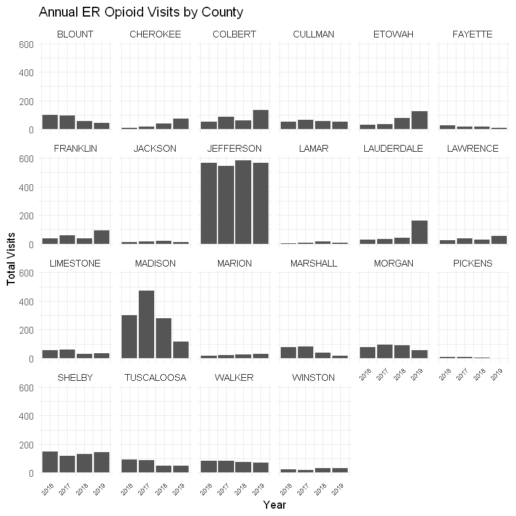
    


```R
## Summary of County by [Quarterly]

# Create year_quarter variable
Data_ER_filted_quarter <- Data_ER_filted %>%
  mutate(
    date = ym(year_month),  # Convert to date
    year = year(date),
    quarter = quarter(date),
    year_quarter = paste0(year, " Q", quarter)
  )

# Group by year_quarter and County
p <- Data_ER_filted_quarter %>%
  group_by(year_quarter, County) %>%
  summarise(total = sum(Count), .groups = "drop") %>%
  mutate(year_quarter = factor(year_quarter, levels = unique(year_quarter))) %>%
  ggplot(aes(x = year_quarter, y = total, group = County)) +
  geom_col(fill = "#555555") +
  facet_wrap(~ County, ncol = 6) +
  labs(
    title = "Quarterly ER Opioid Visits by County",
    x = "Quarter", y = "Total Visits"
  ) +
  theme_minimal() +
  theme(
    axis.text.x = element_text(angle = 45, hjust = 1, size = 6)
  )

# Display plot
print(p)

# Save the figure
ggsave("../output/1_summary_quarter.png", plot = p, width = 8, height = 5.5, dpi = 300)
```


    
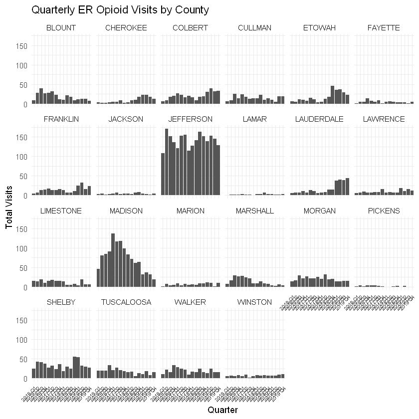
    


```R
## Per Capita of County by Year
p <-Data_ER_filted %>%
  group_by(year, County) %>%
  summarise(total = 100000 * sum(case_percapita), .groups = "drop") %>%
  ggplot(aes(x = year, y = total, group = County)) +
  geom_col(fill = "#555555") +
  # geom_smooth(method = "lm", se = FALSE, color = "red", linewidth = 0.8) +  # Regression line
  facet_wrap(~ County, ncol = 6) + #, scales = "free_y"
  labs(
    title = "Annual Per Capita ER Visits (Per 100,000 Residents) by County",
    x = "Year", y = "Per Capita ER Visits (per 100,000 residents)"
  ) +
  theme_minimal() +
  theme(axis.text.x = element_text(angle = 45, hjust = 1, size = 6))

# Display in notebook
print(p)

# Save the figure
ggsave("../output/1_summary_year_per.png", plot = p, width = 6.5, height = 4.5, dpi = 300)
```


    
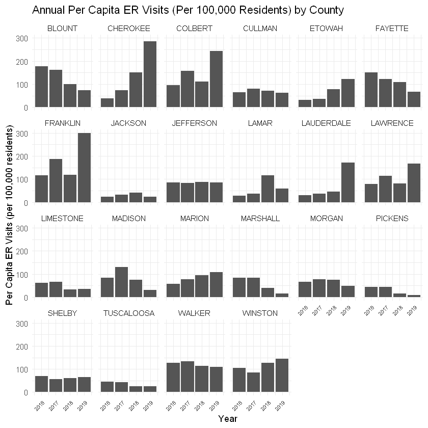
    


```R
## Summary of County by [Per Capita Quarterly]

# Create year_quarter variable
Data_ER_filted_quarter <- Data_ER_filted %>%
  mutate(
    date = ym(year_month),  # Convert to date
    year = year(date),
    quarter = quarter(date),
    year_quarter = paste0(year, " Q", quarter)
  )

# Group by year_quarter and County
p <- Data_ER_filted_quarter %>%
  group_by(year_quarter, County) %>%
  summarise(total = 100000 * sum(case_percapita), .groups = "drop") %>%
  mutate(year_quarter = factor(year_quarter, levels = unique(year_quarter))) %>%
  ggplot(aes(x = year_quarter, y = total, group = County)) +
  geom_col(fill = "#555555") +
  facet_wrap(~ County, ncol = 6) +
  labs(
    title = "Quarterly ER Opioid Visits Per Capita by County",
    x = "Quarter", y = "Total Visits"
  ) +
  theme_minimal() +
  theme(
    axis.text.x = element_text(angle = 45, hjust = 1, size = 6)
  )

# Display plot
print(p)

# Save the figure
ggsave("../output/1_summary_per_quarter.png", plot = p, width = 8, height = 5.5, dpi = 300)
```


    
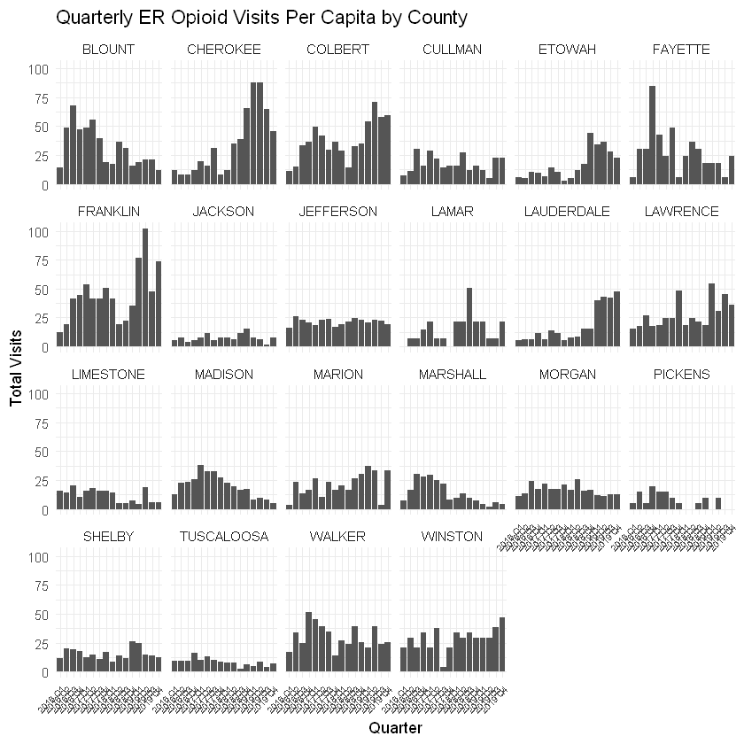
    


### 2. Descriptive Statistic for Medicine Consumption


```R
# Read Data_ARCOS and clean for next process
Data_ARCOS <- read_csv("../Data/ARCOS_AL_2016_2019_cleaned.csv")

Data_ARCOS_filted <- Data_ARCOS%>%
  filter(drug %in% c("OXYCODONE", "HYDROCODONE", "BUPRENORPHINE", "METHADONE"))%>%
  filter(county %in% toupper(c(
    "Lauderdale", "Limestone", "Madison", "Jackson", "Colbert", "Franklin",
    "Lawrence", "Morgan", "Marshall", "Dekalb", "Marion", "Winston",
    "Cullman", "Blount", "Etowah", "Cherokee", "Lamar", "Fayette",
    "Walker", "Jefferson", "St. Clair", "Pickens", "Tuscaloosa", "Shelby"
  ))
  )%>%
  #mutate(mme = mme/1000000)%>%
  mutate(date = mdy(date))%>%
  rename(County = county)

Data_ARCOS_filted <- Data_ARCOS_filted %>%
  mutate(
    year = as.numeric(format(date, "%Y")),
    month = as.numeric(format(date, "%m")),
    year_month = paste(year,month),
    week = as.numeric(format(date, "%U"))  # Week number of year (starting from 0)
  )

head(Data_ARCOS_filted)
```

    New names:
    • `` -> `...1`
    Rows: 1048575 Columns: 7
    ── Column specification ────────────────────────────────────────────────────────────────────────────────────────────────
    Delimiter: ","
    chr (3): date, county, drug
    dbl (4): ...1, mme, pop, mme_percapita
    
    ℹ Use `spec()` to retrieve the full column specification for this data.
    ℹ Specify the column types or set `show_col_types = FALSE` to quiet this message.
    


<table class="dataframe">
<caption>A tibble: 6 × 11</caption>
<thead>
	<tr><th scope=col>...1</th><th scope=col>date</th><th scope=col>County</th><th scope=col>drug</th><th scope=col>mme</th><th scope=col>pop</th><th scope=col>mme_percapita</th><th scope=col>year</th><th scope=col>month</th><th scope=col>year_month</th><th scope=col>week</th></tr>
	<tr><th scope=col>&lt;dbl&gt;</th><th scope=col>&lt;date&gt;</th><th scope=col>&lt;chr&gt;</th><th scope=col>&lt;chr&gt;</th><th scope=col>&lt;dbl&gt;</th><th scope=col>&lt;dbl&gt;</th><th scope=col>&lt;dbl&gt;</th><th scope=col>&lt;dbl&gt;</th><th scope=col>&lt;dbl&gt;</th><th scope=col>&lt;chr&gt;</th><th scope=col>&lt;dbl&gt;</th></tr>
</thead>
<tbody>
	<tr><td>393034</td><td>2016-01-25</td><td>MORGAN</td><td>BUPRENORPHINE</td><td>37218585</td><td>119006</td><td>312.74545</td><td>2016</td><td> 1</td><td>2016 1 </td><td> 4</td></tr>
	<tr><td>394214</td><td>2019-04-19</td><td>MORGAN</td><td>BUPRENORPHINE</td><td> 1833960</td><td>119679</td><td> 15.32399</td><td>2019</td><td> 4</td><td>2019 4 </td><td>15</td></tr>
	<tr><td>394077</td><td>2018-12-03</td><td>MORGAN</td><td>BUPRENORPHINE</td><td> 1813980</td><td>119203</td><td> 15.21757</td><td>2018</td><td>12</td><td>2018 12</td><td>48</td></tr>
	<tr><td>394107</td><td>2019-01-02</td><td>MORGAN</td><td>BUPRENORPHINE</td><td> 1748460</td><td>119679</td><td> 14.60958</td><td>2019</td><td> 1</td><td>2019 1 </td><td> 0</td></tr>
	<tr><td>394225</td><td>2019-04-30</td><td>MORGAN</td><td>BUPRENORPHINE</td><td> 1631160</td><td>119679</td><td> 13.62946</td><td>2019</td><td> 4</td><td>2019 4 </td><td>17</td></tr>
	<tr><td>394154</td><td>2019-02-18</td><td>MORGAN</td><td>BUPRENORPHINE</td><td> 1526094</td><td>119679</td><td> 12.75156</td><td>2019</td><td> 2</td><td>2019 2 </td><td> 7</td></tr>
</tbody>
</table>


```R
# Summary of County
Data_County_ARCOS_summary <- Data_ARCOS_filted %>%
  group_by(year, County, drug) %>%
  summarise(
    mean = mean(mme, na.rm = TRUE),
    total = round(sum(mme/1000000, na.rm = TRUE),2),
      .groups = "drop"
  )%>%
  select(year, County, drug, total) %>%
  pivot_wider(
    names_from = year,
    values_from = total,
    names_prefix = "Total_"
  )%>%
  mutate(
    Total = round(rowSums(select(., starts_with("Total_")), na.rm = TRUE),2)
  )

head(Data_County_ARCOS_summary)

# Save to CSV
#write.csv(Data_County_ARCOS_summary, "../output/Drug_summary.csv", row.names = FALSE)
```


<table class="dataframe">
<caption>A tibble: 6 × 7</caption>
<thead>
	<tr><th scope=col>County</th><th scope=col>drug</th><th scope=col>Total_2016</th><th scope=col>Total_2017</th><th scope=col>Total_2018</th><th scope=col>Total_2019</th><th scope=col>Total</th></tr>
	<tr><th scope=col>&lt;chr&gt;</th><th scope=col>&lt;chr&gt;</th><th scope=col>&lt;dbl&gt;</th><th scope=col>&lt;dbl&gt;</th><th scope=col>&lt;dbl&gt;</th><th scope=col>&lt;dbl&gt;</th><th scope=col>&lt;dbl&gt;</th></tr>
</thead>
<tbody>
	<tr><td>BLOUNT  </td><td>BUPRENORPHINE</td><td>17.63</td><td>19.35</td><td>22.93</td><td>26.66</td><td>86.57</td></tr>
	<tr><td>BLOUNT  </td><td>HYDROCODONE  </td><td> 6.42</td><td> 5.42</td><td> 5.29</td><td> 3.82</td><td>20.95</td></tr>
	<tr><td>BLOUNT  </td><td>METHADONE    </td><td> 1.44</td><td> 1.45</td><td> 1.35</td><td> 1.08</td><td> 5.32</td></tr>
	<tr><td>BLOUNT  </td><td>OXYCODONE    </td><td> 8.97</td><td> 8.13</td><td> 8.00</td><td> 7.23</td><td>32.33</td></tr>
	<tr><td>CHEROKEE</td><td>BUPRENORPHINE</td><td>11.76</td><td>11.53</td><td>16.61</td><td>18.06</td><td>57.96</td></tr>
	<tr><td>CHEROKEE</td><td>HYDROCODONE  </td><td> 7.28</td><td> 6.67</td><td> 6.36</td><td> 5.84</td><td>26.15</td></tr>
</tbody>
</table>


```R
# Summary of Per Capita Drug Consumption by County
Data_County_ARCOS_Annual <- Data_ARCOS_filted %>%
  group_by(year, County, drug) %>%
  summarise(
    mean = mean(mme, na.rm = TRUE),
    total = sum(mme),
    rate = round(mean(mme/pop, na.rm = TRUE), 2), 
      .groups = "drop"
  )%>%
  select(year, County, drug, rate) %>%
  pivot_wider(
    names_from = year,
    values_from = rate,
    names_prefix = "Rate_"
  )%>%
  mutate(
    Avg_Rate = round(rowMeans(select(., starts_with("Rate_")), na.rm = TRUE),2)
  )

head(Data_County_ARCOS_Annual)
```


<table class="dataframe">
<caption>A tibble: 6 × 7</caption>
<thead>
	<tr><th scope=col>County</th><th scope=col>drug</th><th scope=col>Rate_2016</th><th scope=col>Rate_2017</th><th scope=col>Rate_2018</th><th scope=col>Rate_2019</th><th scope=col>Avg_Rate</th></tr>
	<tr><th scope=col>&lt;chr&gt;</th><th scope=col>&lt;chr&gt;</th><th scope=col>&lt;dbl&gt;</th><th scope=col>&lt;dbl&gt;</th><th scope=col>&lt;dbl&gt;</th><th scope=col>&lt;dbl&gt;</th><th scope=col>&lt;dbl&gt;</th></tr>
</thead>
<tbody>
	<tr><td>BLOUNT  </td><td>BUPRENORPHINE</td><td>0.84</td><td>0.92</td><td>1.09</td><td>1.26</td><td>1.03</td></tr>
	<tr><td>BLOUNT  </td><td>HYDROCODONE  </td><td>0.31</td><td>0.26</td><td>0.25</td><td>0.18</td><td>0.25</td></tr>
	<tr><td>BLOUNT  </td><td>METHADONE    </td><td>0.07</td><td>0.07</td><td>0.06</td><td>0.05</td><td>0.06</td></tr>
	<tr><td>BLOUNT  </td><td>OXYCODONE    </td><td>0.43</td><td>0.39</td><td>0.38</td><td>0.34</td><td>0.38</td></tr>
	<tr><td>CHEROKEE</td><td>BUPRENORPHINE</td><td>1.25</td><td>1.22</td><td>1.75</td><td>1.89</td><td>1.53</td></tr>
	<tr><td>CHEROKEE</td><td>HYDROCODONE  </td><td>0.77</td><td>0.71</td><td>0.67</td><td>0.61</td><td>0.69</td></tr>
</tbody>
</table>


#### 2.1 Descriptive Table of Buprenorphine


```R
# merge all tables of BUPRENORPHINE

Data_County_ARCOS_Summary_temp <- Data_County_ARCOS_summary%>%
    filter(drug == "BUPRENORPHINE")%>%
    select(-drug)

Data_County_ARCOS_Annual_temp <- Data_County_ARCOS_Annual%>%
    filter(drug == "BUPRENORPHINE")%>%
    select(-drug)

Data_County_pop_sum <- merge(
  County_population_average,
  Data_County_ARCOS_Summary_temp, 
  by = "County"
)

Data_County_pop_sum_rate <- merge(
  Data_County_pop_sum,
  Data_County_ARCOS_Annual_temp, 
  by = "County"
)

Data_County_combined <- Data_County_pop_sum_rate%>%
  select(
    County,
    pop_avg,
    pop_avg,
    Total_2016, Rate_2016,
    Total_2017, Rate_2017,
    Total_2018, Rate_2018,
    Total_2019, Rate_2019,
    Total, Avg_Rate
  )

head(Data_County_combined)

# Save to CSV
write.csv(Data_County_combined, "../output/County_BUPRENORPHINE.csv", row.names = FALSE)
```


<table class="dataframe">
<caption>A data.frame: 6 × 12</caption>
<thead>
	<tr><th></th><th scope=col>County</th><th scope=col>pop_avg</th><th scope=col>Total_2016</th><th scope=col>Rate_2016</th><th scope=col>Total_2017</th><th scope=col>Rate_2017</th><th scope=col>Total_2018</th><th scope=col>Rate_2018</th><th scope=col>Total_2019</th><th scope=col>Rate_2019</th><th scope=col>Total</th><th scope=col>Avg_Rate</th></tr>
	<tr><th></th><th scope=col>&lt;chr&gt;</th><th scope=col>&lt;dbl&gt;</th><th scope=col>&lt;dbl&gt;</th><th scope=col>&lt;dbl&gt;</th><th scope=col>&lt;dbl&gt;</th><th scope=col>&lt;dbl&gt;</th><th scope=col>&lt;dbl&gt;</th><th scope=col>&lt;dbl&gt;</th><th scope=col>&lt;dbl&gt;</th><th scope=col>&lt;dbl&gt;</th><th scope=col>&lt;dbl&gt;</th><th scope=col>&lt;dbl&gt;</th></tr>
</thead>
<tbody>
	<tr><th scope=row>1</th><td>BLOUNT  </td><td> 57719.35</td><td> 17.63</td><td>0.84</td><td> 19.35</td><td>0.92</td><td> 22.93</td><td>1.09</td><td> 26.66</td><td>1.26</td><td> 86.57</td><td>1.03</td></tr>
	<tr><th scope=row>2</th><td>CHEROKEE</td><td> 25945.63</td><td> 11.76</td><td>1.25</td><td> 11.53</td><td>1.22</td><td> 16.61</td><td>1.75</td><td> 18.06</td><td>1.89</td><td> 57.96</td><td>1.53</td></tr>
	<tr><th scope=row>3</th><td>COLBERT </td><td> 54859.00</td><td> 42.67</td><td>2.14</td><td> 56.49</td><td>2.83</td><td> 55.73</td><td>2.78</td><td> 69.08</td><td>3.43</td><td>223.97</td><td>2.80</td></tr>
	<tr><th scope=row>4</th><td>CULLMAN </td><td> 83125.29</td><td> 55.68</td><td>1.84</td><td> 61.61</td><td>2.04</td><td> 71.18</td><td>2.34</td><td> 79.75</td><td>2.61</td><td>268.22</td><td>2.21</td></tr>
	<tr><th scope=row>5</th><td>ETOWAH  </td><td>102685.37</td><td>123.16</td><td>3.27</td><td>159.93</td><td>4.25</td><td>165.87</td><td>4.43</td><td>179.13</td><td>4.80</td><td>628.09</td><td>4.19</td></tr>
	<tr><th scope=row>6</th><td>FAYETTE </td><td> 16444.08</td><td>  1.63</td><td>0.27</td><td>  2.02</td><td>0.34</td><td>  2.58</td><td>0.43</td><td>  4.67</td><td>0.79</td><td> 10.90</td><td>0.46</td></tr>
</tbody>
</table>


#### 2.2 Descriptive Table of HYDROCODONE


```R
# merge all tables of HYDROCODONE

Data_County_ARCOS_Summary_temp <- Data_County_ARCOS_summary%>%
    filter(drug == "HYDROCODONE")%>%
    select(-drug)

Data_County_ARCOS_Annual_temp <- Data_County_ARCOS_Annual%>%
    filter(drug == "HYDROCODONE")%>%
    select(-drug)

Data_County_pop_sum <- merge(
  County_population_average,
  Data_County_ARCOS_Summary_temp, 
  by = "County"
)

Data_County_pop_sum_rate <- merge(
  Data_County_pop_sum,
  Data_County_ARCOS_Annual_temp, 
  by = "County"
)

Data_County_combined <- Data_County_pop_sum_rate%>%
  select(
    County,
    pop_avg,
    pop_avg,
    Total_2016, Rate_2016,
    Total_2017, Rate_2017,
    Total_2018, Rate_2018,
    Total_2019, Rate_2019,
    Total, Avg_Rate
  )

head(Data_County_combined)

# Save to CSV
write.csv(Data_County_combined, "../output/County_HYDROCODONE.csv", row.names = FALSE)
```


<table class="dataframe">
<caption>A data.frame: 6 × 12</caption>
<thead>
	<tr><th></th><th scope=col>County</th><th scope=col>pop_avg</th><th scope=col>Total_2016</th><th scope=col>Rate_2016</th><th scope=col>Total_2017</th><th scope=col>Rate_2017</th><th scope=col>Total_2018</th><th scope=col>Rate_2018</th><th scope=col>Total_2019</th><th scope=col>Rate_2019</th><th scope=col>Total</th><th scope=col>Avg_Rate</th></tr>
	<tr><th></th><th scope=col>&lt;chr&gt;</th><th scope=col>&lt;dbl&gt;</th><th scope=col>&lt;dbl&gt;</th><th scope=col>&lt;dbl&gt;</th><th scope=col>&lt;dbl&gt;</th><th scope=col>&lt;dbl&gt;</th><th scope=col>&lt;dbl&gt;</th><th scope=col>&lt;dbl&gt;</th><th scope=col>&lt;dbl&gt;</th><th scope=col>&lt;dbl&gt;</th><th scope=col>&lt;dbl&gt;</th><th scope=col>&lt;dbl&gt;</th></tr>
</thead>
<tbody>
	<tr><th scope=row>1</th><td>BLOUNT  </td><td> 57719.35</td><td> 6.42</td><td>0.31</td><td> 5.42</td><td>0.26</td><td> 5.29</td><td>0.25</td><td> 3.82</td><td>0.18</td><td> 20.95</td><td>0.25</td></tr>
	<tr><th scope=row>2</th><td>CHEROKEE</td><td> 25945.63</td><td> 7.28</td><td>0.77</td><td> 6.67</td><td>0.71</td><td> 6.36</td><td>0.67</td><td> 5.84</td><td>0.61</td><td> 26.15</td><td>0.69</td></tr>
	<tr><th scope=row>3</th><td>COLBERT </td><td> 54859.00</td><td>25.48</td><td>1.28</td><td>23.84</td><td>1.19</td><td>21.63</td><td>1.08</td><td>20.04</td><td>0.99</td><td> 90.99</td><td>1.14</td></tr>
	<tr><th scope=row>4</th><td>CULLMAN </td><td> 83125.29</td><td>24.40</td><td>0.81</td><td>21.09</td><td>0.70</td><td>17.76</td><td>0.58</td><td>15.03</td><td>0.49</td><td> 78.28</td><td>0.64</td></tr>
	<tr><th scope=row>5</th><td>ETOWAH  </td><td>102685.37</td><td>32.42</td><td>0.86</td><td>28.59</td><td>0.76</td><td>27.17</td><td>0.73</td><td>24.78</td><td>0.66</td><td>112.96</td><td>0.75</td></tr>
	<tr><th scope=row>6</th><td>FAYETTE </td><td> 16444.08</td><td> 2.64</td><td>0.44</td><td> 2.24</td><td>0.37</td><td> 1.85</td><td>0.31</td><td> 1.70</td><td>0.29</td><td>  8.43</td><td>0.35</td></tr>
</tbody>
</table>


#### 2.3 Descriptive Table of METHADONE


```R
# merge all tables of METHADONE

Data_County_ARCOS_Summary_temp <- Data_County_ARCOS_summary%>%
    filter(drug == "METHADONE")%>%
    select(-drug)

Data_County_ARCOS_Annual_temp <- Data_County_ARCOS_Annual%>%
    filter(drug == "METHADONE")%>%
    select(-drug)

Data_County_pop_sum <- merge(
  County_population_average,
  Data_County_ARCOS_Summary_temp, 
  by = "County"
)

Data_County_pop_sum_rate <- merge(
  Data_County_pop_sum,
  Data_County_ARCOS_Annual_temp, 
  by = "County"
)

Data_County_combined <- Data_County_pop_sum_rate%>%
  select(
    County,
    pop_avg,
    pop_avg,
    Total_2016, Rate_2016,
    Total_2017, Rate_2017,
    Total_2018, Rate_2018,
    Total_2019, Rate_2019,
    Total, Avg_Rate
  )

head(Data_County_combined)

# Save to CSV
write.csv(Data_County_combined, "../output/County_METHADONE.csv", row.names = FALSE)
```


<table class="dataframe">
<caption>A data.frame: 6 × 12</caption>
<thead>
	<tr><th></th><th scope=col>County</th><th scope=col>pop_avg</th><th scope=col>Total_2016</th><th scope=col>Rate_2016</th><th scope=col>Total_2017</th><th scope=col>Rate_2017</th><th scope=col>Total_2018</th><th scope=col>Rate_2018</th><th scope=col>Total_2019</th><th scope=col>Rate_2019</th><th scope=col>Total</th><th scope=col>Avg_Rate</th></tr>
	<tr><th></th><th scope=col>&lt;chr&gt;</th><th scope=col>&lt;dbl&gt;</th><th scope=col>&lt;dbl&gt;</th><th scope=col>&lt;dbl&gt;</th><th scope=col>&lt;dbl&gt;</th><th scope=col>&lt;dbl&gt;</th><th scope=col>&lt;dbl&gt;</th><th scope=col>&lt;dbl&gt;</th><th scope=col>&lt;dbl&gt;</th><th scope=col>&lt;dbl&gt;</th><th scope=col>&lt;dbl&gt;</th><th scope=col>&lt;dbl&gt;</th></tr>
</thead>
<tbody>
	<tr><th scope=row>1</th><td>BLOUNT  </td><td> 57719.35</td><td> 1.44</td><td>0.07</td><td> 1.45</td><td>0.07</td><td>1.35</td><td>0.06</td><td>1.08</td><td>0.05</td><td> 5.32</td><td>0.06</td></tr>
	<tr><th scope=row>2</th><td>CHEROKEE</td><td> 25945.63</td><td> 2.30</td><td>0.24</td><td> 0.77</td><td>0.08</td><td>0.78</td><td>0.08</td><td>0.43</td><td>0.05</td><td> 4.28</td><td>0.11</td></tr>
	<tr><th scope=row>3</th><td>COLBERT </td><td> 54859.00</td><td> 6.89</td><td>0.35</td><td> 4.86</td><td>0.24</td><td>4.22</td><td>0.21</td><td>3.45</td><td>0.17</td><td>19.42</td><td>0.24</td></tr>
	<tr><th scope=row>4</th><td>CULLMAN </td><td> 83125.29</td><td>11.48</td><td>0.38</td><td> 8.04</td><td>0.27</td><td>5.81</td><td>0.19</td><td>3.78</td><td>0.12</td><td>29.11</td><td>0.24</td></tr>
	<tr><th scope=row>5</th><td>ETOWAH  </td><td>102685.37</td><td>19.48</td><td>0.52</td><td>10.42</td><td>0.28</td><td>8.29</td><td>0.22</td><td>6.76</td><td>0.18</td><td>44.95</td><td>0.30</td></tr>
	<tr><th scope=row>6</th><td>FAYETTE </td><td> 16444.08</td><td> 3.91</td><td>0.65</td><td> 3.53</td><td>0.59</td><td>2.77</td><td>0.46</td><td>2.41</td><td>0.40</td><td>12.62</td><td>0.52</td></tr>
</tbody>
</table>


#### 2.4 Descriptive Table of OXYCODONE


```R
# merge all tables of OXYCODONE

Data_County_ARCOS_Summary_temp <- Data_County_ARCOS_summary%>%
    filter(drug == "OXYCODONE")%>%
    select(-drug)

Data_County_ARCOS_Annual_temp <- Data_County_ARCOS_Annual%>%
    filter(drug == "OXYCODONE")%>%
    select(-drug)

Data_County_pop_sum <- merge(
  County_population_average,
  Data_County_ARCOS_Summary_temp, 
  by = "County"
)

Data_County_pop_sum_rate <- merge(
  Data_County_pop_sum,
  Data_County_ARCOS_Annual_temp, 
  by = "County"
)

Data_County_combined <- Data_County_pop_sum_rate%>%
  select(
    County,
    pop_avg,
    pop_avg,
    Total_2016, Rate_2016,
    Total_2017, Rate_2017,
    Total_2018, Rate_2018,
    Total_2019, Rate_2019,
    Total, Avg_Rate
  )

head(Data_County_combined)

# Save to CSV
write.csv(Data_County_combined, "../output/County_OXYCODONE.csv", row.names = FALSE)
```


<table class="dataframe">
<caption>A data.frame: 6 × 12</caption>
<thead>
	<tr><th></th><th scope=col>County</th><th scope=col>pop_avg</th><th scope=col>Total_2016</th><th scope=col>Rate_2016</th><th scope=col>Total_2017</th><th scope=col>Rate_2017</th><th scope=col>Total_2018</th><th scope=col>Rate_2018</th><th scope=col>Total_2019</th><th scope=col>Rate_2019</th><th scope=col>Total</th><th scope=col>Avg_Rate</th></tr>
	<tr><th></th><th scope=col>&lt;chr&gt;</th><th scope=col>&lt;dbl&gt;</th><th scope=col>&lt;dbl&gt;</th><th scope=col>&lt;dbl&gt;</th><th scope=col>&lt;dbl&gt;</th><th scope=col>&lt;dbl&gt;</th><th scope=col>&lt;dbl&gt;</th><th scope=col>&lt;dbl&gt;</th><th scope=col>&lt;dbl&gt;</th><th scope=col>&lt;dbl&gt;</th><th scope=col>&lt;dbl&gt;</th><th scope=col>&lt;dbl&gt;</th></tr>
</thead>
<tbody>
	<tr><th scope=row>1</th><td>BLOUNT  </td><td> 57719.35</td><td> 8.97</td><td>0.43</td><td> 8.13</td><td>0.39</td><td> 8.00</td><td>0.38</td><td> 7.23</td><td>0.34</td><td> 32.33</td><td>0.38</td></tr>
	<tr><th scope=row>2</th><td>CHEROKEE</td><td> 25945.63</td><td>14.52</td><td>1.54</td><td>11.99</td><td>1.27</td><td>11.10</td><td>1.17</td><td>10.03</td><td>1.05</td><td> 47.64</td><td>1.26</td></tr>
	<tr><th scope=row>3</th><td>COLBERT </td><td> 54859.00</td><td>31.91</td><td>1.60</td><td>25.49</td><td>1.28</td><td>19.39</td><td>0.97</td><td>16.66</td><td>0.83</td><td> 93.45</td><td>1.17</td></tr>
	<tr><th scope=row>4</th><td>CULLMAN </td><td> 83125.29</td><td>34.24</td><td>1.13</td><td>30.80</td><td>1.02</td><td>24.77</td><td>0.81</td><td>20.75</td><td>0.68</td><td>110.56</td><td>0.91</td></tr>
	<tr><th scope=row>5</th><td>ETOWAH  </td><td>102685.37</td><td>63.52</td><td>1.69</td><td>49.82</td><td>1.33</td><td>46.21</td><td>1.23</td><td>40.96</td><td>1.10</td><td>200.51</td><td>1.34</td></tr>
	<tr><th scope=row>6</th><td>FAYETTE </td><td> 16444.08</td><td> 3.96</td><td>0.65</td><td> 3.32</td><td>0.55</td><td> 2.74</td><td>0.46</td><td> 1.95</td><td>0.33</td><td> 11.97</td><td>0.50</td></tr>
</tbody>
</table>


```R
# Summary of County by Year
Data_County_ARCOS_Annual <- Data_ARCOS_filted %>%
  group_by(County, drug, year) %>%
  summarise(
    mean = mean(mme, na.rm = TRUE),
    total = sum(mme),
    avg_percapita = mean(mme_percapita),
      .groups = "drop"
  )

head(Data_County_ARCOS_Annual)

# Save to CSV
write.csv(Data_County_ARCOS_Annual, "../output/Drug_Annual.csv", row.names = FALSE)
```


<table class="dataframe">
<caption>A tibble: 6 × 6</caption>
<thead>
	<tr><th scope=col>County</th><th scope=col>drug</th><th scope=col>year</th><th scope=col>mean</th><th scope=col>total</th><th scope=col>avg_percapita</th></tr>
	<tr><th scope=col>&lt;chr&gt;</th><th scope=col>&lt;chr&gt;</th><th scope=col>&lt;dbl&gt;</th><th scope=col>&lt;dbl&gt;</th><th scope=col>&lt;dbl&gt;</th><th scope=col>&lt;dbl&gt;</th></tr>
</thead>
<tbody>
	<tr><td>BLOUNT</td><td>BUPRENORPHINE</td><td>2016</td><td>0.04815740</td><td>17.625610</td><td>0.8376075</td></tr>
	<tr><td>BLOUNT</td><td>BUPRENORPHINE</td><td>2017</td><td>0.05302161</td><td>19.352887</td><td>0.9175352</td></tr>
	<tr><td>BLOUNT</td><td>BUPRENORPHINE</td><td>2018</td><td>0.06281466</td><td>22.927352</td><td>1.0873044</td></tr>
	<tr><td>BLOUNT</td><td>BUPRENORPHINE</td><td>2019</td><td>0.07305012</td><td>26.663294</td><td>1.2632747</td></tr>
	<tr><td>BLOUNT</td><td>HYDROCODONE  </td><td>2016</td><td>0.01753648</td><td> 6.418353</td><td>0.3050142</td></tr>
	<tr><td>BLOUNT</td><td>HYDROCODONE  </td><td>2017</td><td>0.01485602</td><td> 5.422446</td><td>0.2570823</td></tr>
</tbody>
</table>


```R
# Trends for All Medicine Consumption [Annually]
p1<-Data_ARCOS_filted %>%
  filter(drug == "OXYCODONE")%>%
  group_by(year, County, drug) %>%
  summarise(total = sum(mme), .groups = "drop") %>%
  ggplot(aes(x = year, y = total)) +
  geom_col(position = "dodge") +
  # geom_smooth(method = "lm", se = FALSE, color = "red", linewidth = 0.8) +  # Regression line
  facet_wrap( ~ County, ncol = 6) + #, scales = "free_y"
  labs(
    title = "Annual Oxycodone Consumption by County in MME",
    x = "Year", y = "Total MME (in Millions)"
  ) +
  theme_minimal() +
  theme(
    legend.position = "top",
    axis.text.x = element_text(angle = 45, hjust = 1, size = 6))


p2<-Data_ARCOS_filted %>%
  filter(drug == "METHADONE")%>%
  group_by(year, County, drug) %>%
  summarise(total = sum(mme), .groups = "drop") %>%
  ggplot(aes(x = year, y = total)) +
  geom_col(position = "dodge") +
  # geom_smooth(method = "lm", se = FALSE, color = "red", linewidth = 0.8) +  # Regression line
  facet_wrap( ~ County, ncol = 6) + #, scales = "free_y"
  labs(
    title = "Annually Methadone Consumption by County in MME",
    x = "Year", y = "Total MME (in Millions)"
  ) +
  theme_minimal() +
  theme(
    legend.position = "top",
    axis.text.x = element_text(angle = 45, hjust = 1, size = 6))


p3<-Data_ARCOS_filted %>%
  filter(drug == "BUPRENORPHINE")%>%
  group_by(year, County, drug) %>%
  summarise(total = sum(mme), .groups = "drop") %>%
  ggplot(aes(x = year, y = total)) +
  geom_col(position = "dodge") +
  # geom_smooth(method = "lm", se = FALSE, color = "red", linewidth = 0.8) +  # Regression line
  facet_wrap( ~ County, ncol = 6) + #, scales = "free_y"
  labs(
    title = "Annually Buprenorphine Consumption by County in MME",
    x = "Year", y = "Total MME (in Millions)"
  ) +
  theme_minimal() +
  theme(
    legend.position = "top",
    axis.text.x = element_text(angle = 45, hjust = 1, size = 6))


p4<-Data_ARCOS_filted %>%
  filter(drug == "HYDROCODONE")%>%
  group_by(year, County, drug) %>%
  summarise(total = sum(mme), .groups = "drop") %>%
  ggplot(aes(x = year, y = total)) +
  geom_col(position = "dodge") +
  # geom_smooth(method = "lm", se = FALSE, color = "red", linewidth = 0.8) +  # Regression line
  facet_wrap( ~ County, ncol = 6) + #, scales = "free_y"
  labs(
    title = "Annually Hydrocodone Consumption by County in MME",
    x = "Year", y = "Total MME (in Millions)"
  ) +
  theme_minimal() +
  theme(
    legend.position = "top",
    axis.text.x = element_text(angle = 45, hjust = 1, size = 6))

p1
p2
p3
p4
```


    
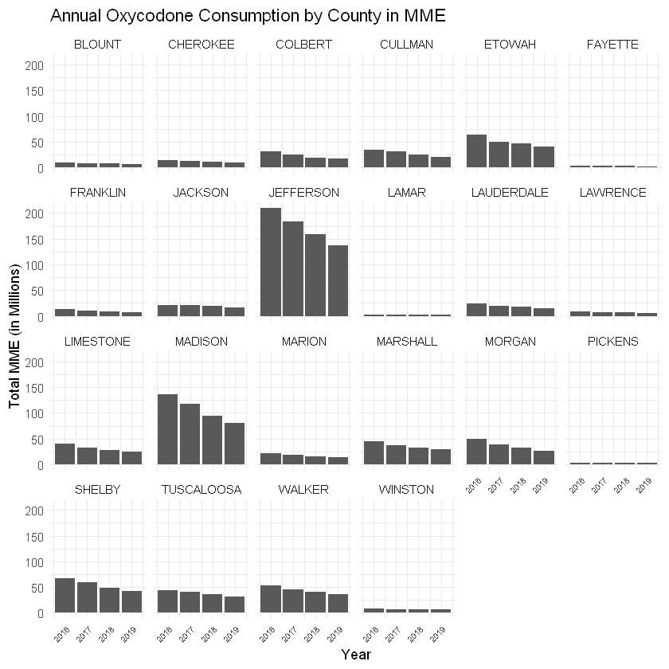
    


    
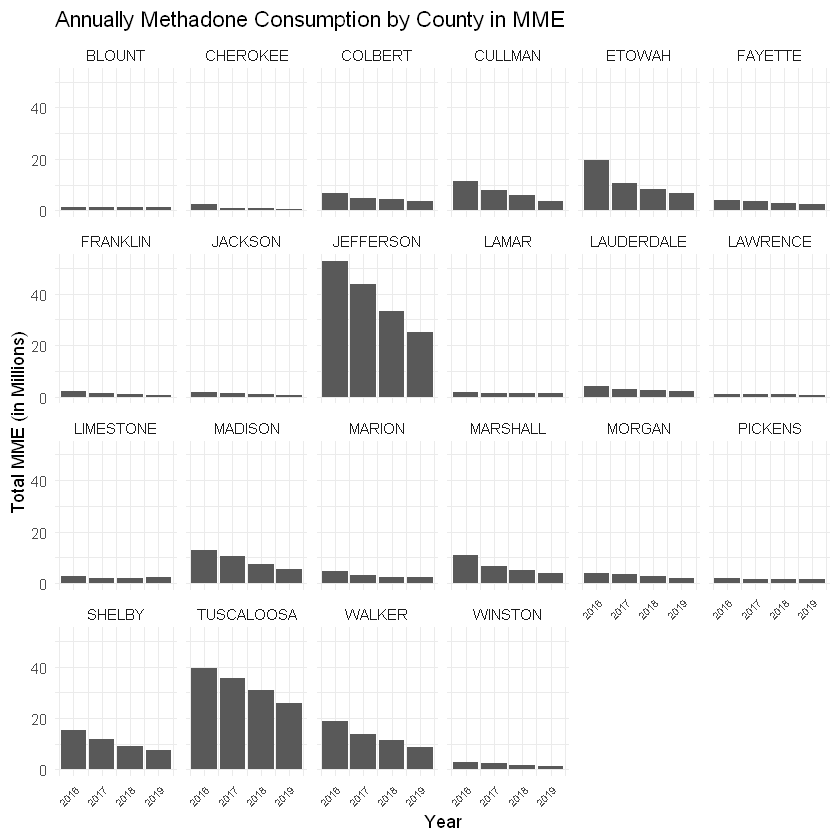
    


    
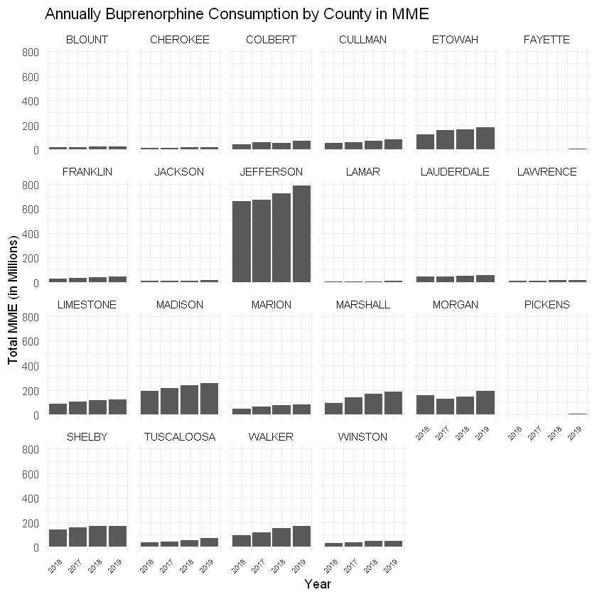
    


    
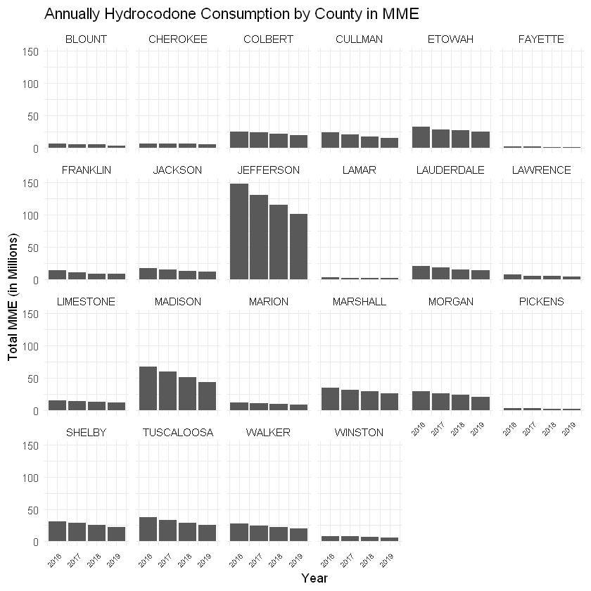
    


```R
# Trends for All Medicine Consumption [Annually] All in One

p_all <- Data_ARCOS_filted %>%
  filter(drug %in% c("OXYCODONE", "METHADONE", "BUPRENORPHINE", "HYDROCODONE")) %>%
  group_by(year, County, drug) %>%
  summarise(total = sum(mme), .groups = "drop") %>%
  ggplot(aes(x = year, y = total)) +
  geom_col(position = "dodge", fill = "#4682B4") +
facet_grid(drug ~ County) + #, scales = "free_y"
  labs(
    title = "Annual Opioid Medication Consumption by County and Drug (in MME)",
    x = "Year", y = "Total MME"
  ) +
  theme_minimal() +
  theme(
    strip.text.x = element_text(angle = 60,size = 6),
    strip.text.y = element_text(size = 8, face = "bold"),
    axis.text.x = element_text(angle = 90, hjust = 1, size = 5)
  )

p_all

# Save the figure
ggsave("../output/2_medicine_annual.png", plot = p_all, width = 8, height = 6, dpi = 300)

```


    
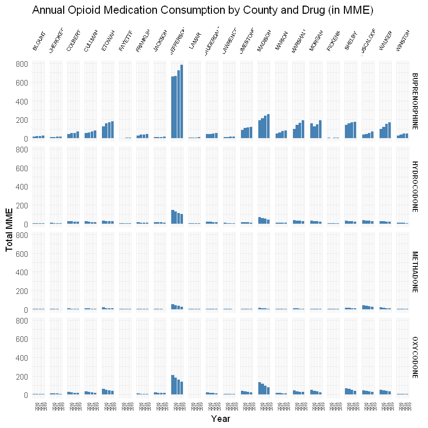
    


```R
# Trends for All Medicine Consumption Rate [Annually] All in One
p_all <- Data_ARCOS_filted %>%
  filter(drug %in% c("OXYCODONE", "METHADONE", "BUPRENORPHINE", "HYDROCODONE")) %>%
  group_by(year, County, drug) %>%
  summarise(rate = mean(mme_percapita), .groups = "drop") %>%
  ggplot(aes(x = year, y = rate)) +
  geom_col(position = "dodge", fill = "#4682B4") +
facet_grid(drug ~ County) + #, scales = "free_y"
  labs(
    title = "Annual Opioid Medication Consumption Rate by County and Drug (in MME)",
    x = "Year", y = "Total MME"
  ) +
  theme_minimal() +
  theme(
    strip.text.x = element_text(angle = 60,size = 6),
    strip.text.y = element_text(size = 8, face = "bold"),
    axis.text.x = element_text(angle = 90, hjust = 1, size = 5)
  )

p_all

# Save the figure
ggsave("../output/2_medicine_rate_annual.png", plot = p_all, width = 8, height = 6, dpi = 300)

```


    
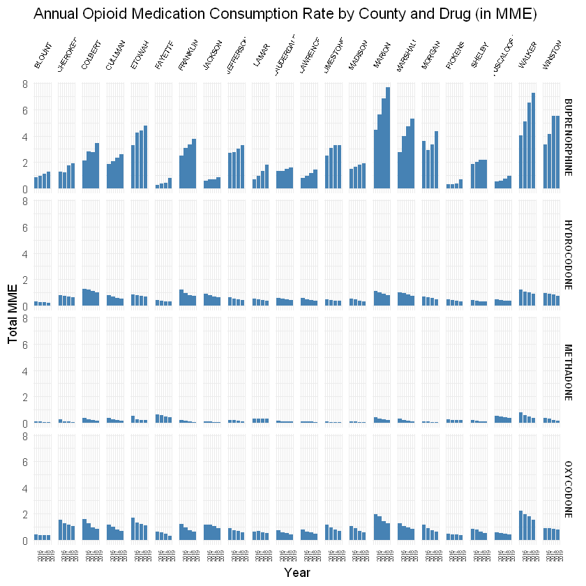
    


```R
# Summary of County by Month
Data_ARCOS_filted %>%
  filter(drug=="BUPRENORPHINE")%>%
  group_by(year_month, County, drug) %>%
  summarise(total = sum(mme), .groups = "drop") %>%
  ggplot(aes(x = year_month, y = total, group = drug)) +
  # geom_line(aes(color=drug)) +
  # geom_smooth(method = "lm", se = FALSE, color = "red", linewidth = 0.8) +  # Regression line
  geom_point(size = 0.5) +
  # geom_line() +
  scale_x_discrete(
    breaks = function(x) x[seq(1, length(x), by = 12)]
  ) +
  facet_wrap( ~ County, ncol = 6, scales = "free_y") + #
  scale_color_manual(values = colors) +  # Correct scale for lines
  labs(
    title = "Monthly Buprenorphine Consumption by County",
    x = "Month", y = "Total MME (in Million)"
  ) +
  theme_minimal() +
  theme(
    legend.position = "top",
    axis.text.x = element_text(angle = 45, hjust = 1, size = 6))


# Per Capita of County by Month 
Data_ARCOS_filted %>%
  filter(drug=="METHADONE")%>%
  group_by(year_month, County, drug) %>%
  summarise(total = sum(mme_percapita), .groups = "drop") %>%
  ggplot(aes(x = year_month, y = total, group = drug)) +
  # geom_line(aes(color=drug)) +
  # geom_smooth(method = "lm", se = FALSE, color = "red", linewidth = 0.8) +  # Regression line
  geom_point(size = 0.5) +
  # geom_line() +
  scale_x_discrete(
    breaks = function(x) x[seq(1, length(x), by = 12)]
  ) +
  facet_wrap( ~ County, ncol = 6) + #, scales = "free_y"
  scale_color_manual(values = colors) +  # Correct scale for lines
  labs(
    title = "Monthly Per Capita Methadone Consumption by County",
    x = "Month", y = "Total MME (in Million)"
  ) +
  theme_minimal() +
  theme(
    legend.position = "top",
    axis.text.x = element_text(angle = 45, hjust = 1, size = 6))


Data_ARCOS_filted %>%
  filter(drug=="BUPRENORPHINE")%>%
  group_by(year_month, County) %>%
  summarise(total = sum(mme), .groups = "drop") %>%
  ggplot(aes(x = year_month, y = fct_rev(factor(County)), fill = total)) +
  geom_tile() +
  scale_fill_gradient(low = "white", high = "steelblue") +
  labs(title = "Heatmap of BUPRENORPHINE", x = "Month", y = "County") +
  theme_minimal() +
  theme(axis.text.x = element_text(angle = 45, hjust = 1))


Data_ARCOS_filted %>%
  filter(drug=="HYDROCODONE")%>%
  group_by(year_month, County) %>%
  summarise(total = sum(mme), .groups = "drop") %>%
  ggplot(aes(x = year_month, y = fct_rev(factor(County)), fill = total)) +
  geom_tile() +
  scale_fill_gradient(low = "white", high = "steelblue") +
  labs(title = "Heatmap of HYDROCODONE", x = "Month", y = "County") +
  theme_minimal() +
  theme(axis.text.x = element_text(angle = 45, hjust = 1))

Data_ARCOS_filted %>%
  filter(drug=="METHADONE")%>%
  group_by(year_month, County) %>%
  summarise(total = sum(mme), .groups = "drop") %>%
  ggplot(aes(x = year_month, y = fct_rev(factor(County)), fill = total)) +
  geom_tile() +
  scale_fill_gradient(low = "white", high = "steelblue") +
  labs(title = "Heatmap of METHADONE", x = "Month", y = "County") +
  theme_minimal() +
  theme(axis.text.x = element_text(angle = 45, hjust = 1))

Data_ARCOS_filted %>%
  filter(drug=="OXYCODONE")%>%
  group_by(year_month, County) %>%
  summarise(total = sum(mme), .groups = "drop") %>%
  ggplot(aes(x = year_month, y = fct_rev(factor(County)), fill = total)) +
  geom_tile() +
  scale_fill_gradient(low = "white", high = "steelblue") +
  labs(title = "Heatmap of OXYCODONE", x = "Month", y = "County") +
  theme_minimal() +
  theme(axis.text.x = element_text(angle = 45, hjust = 1))
  


## Create Aggrated Data
# Read Data_ARCOS
Data_ARCOS <- read_csv("Data/ARCOS_AL_2016_2019_cleaned.csv")


agg_data_BUPRENORPHINE <- Data_ARCOS %>%
  filter(drug=="BUPRENORPHINE")%>%
  group_by(County) %>%
  summarise(
    total = sum(mme, na.rm = TRUE),
    avg_percapita = mean(mme_percapita, na.rm = TRUE)
  )%>%
  mutate(County = str_to_title(County))%>%
  filter(County %in% c(
    "Lauderdale", "Limestone", "Madison", "Jackson", "Colbert", "Franklin",
    "Lawrence", "Morgan", "Marshall", "Dekalb", "Marion", "Winston",
    "Cullman", "Blount", "Etowah", "Cherokee", "Lamar", "Fayette",
    "Walker", "Jefferson", "St. Clair", "Pickens", "Tuscaloosa", "Shelby"
  ))

agg_data_HYDROCODONE <- Data_ARCOS %>%
  filter(drug=="HYDROCODONE")%>%
  group_by(County) %>%
  summarise(
    total = sum(mme, na.rm = TRUE),
    avg_percapita = mean(mme_percapita, na.rm = TRUE)
  )%>%
  mutate(County = str_to_title(County))%>%
  filter(County %in% c(
    "Lauderdale", "Limestone", "Madison", "Jackson", "Colbert", "Franklin",
    "Lawrence", "Morgan", "Marshall", "Dekalb", "Marion", "Winston",
    "Cullman", "Blount", "Etowah", "Cherokee", "Lamar", "Fayette",
    "Walker", "Jefferson", "St. Clair", "Pickens", "Tuscaloosa", "Shelby"
  ))


agg_data_OXYCODONE <- Data_ARCOS %>%
  filter(drug=="OXYCODONE")%>%
  group_by(County) %>%
  summarise(
    total = sum(mme, na.rm = TRUE),
    avg_percapita = mean(mme_percapita, na.rm = TRUE)
  )%>%
  mutate(County = str_to_title(County))%>%
  filter(County %in% c(
    "Lauderdale", "Limestone", "Madison", "Jackson", "Colbert", "Franklin",
    "Lawrence", "Morgan", "Marshall", "Dekalb", "Marion", "Winston",
    "Cullman", "Blount", "Etowah", "Cherokee", "Lamar", "Fayette",
    "Walker", "Jefferson", "St. Clair", "Pickens", "Tuscaloosa", "Shelby"
  ))


agg_data_METHADONE <- Data_ARCOS %>%
  filter(drug=="METHADONE")%>%
  group_by(County) %>%
  summarise(
    total = sum(mme, na.rm = TRUE),
    avg_percapita = mean(mme_percapita, na.rm = TRUE)
  )%>%
  mutate(County = str_to_title(County))%>%
  filter(County %in% c(
    "Lauderdale", "Limestone", "Madison", "Jackson", "Colbert", "Franklin",
    "Lawrence", "Morgan", "Marshall", "Dekalb", "Marion", "Winston",
    "Cullman", "Blount", "Etowah", "Cherokee", "Lamar", "Fayette",
    "Walker", "Jefferson", "St. Clair", "Pickens", "Tuscaloosa", "Shelby"
  ))


write.csv(agg_data_BUPRENORPHINE, "Data/agg_data_BUPRENORPHINE.csv")
write.csv(agg_data_HYDROCODONE, "Data/agg_data_HYDROCODONE.csv")
write.csv(agg_data_OXYCODONE, "Data/agg_data_OXYCODONE.csv")
write.csv(agg_data_METHADONE, "Data/agg_data_METHADONE.csv")


#Year-on-year Month-on-month
```


    
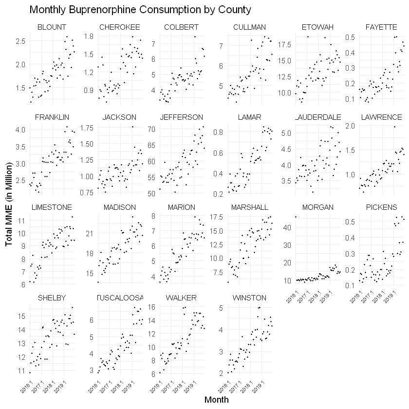
    


    
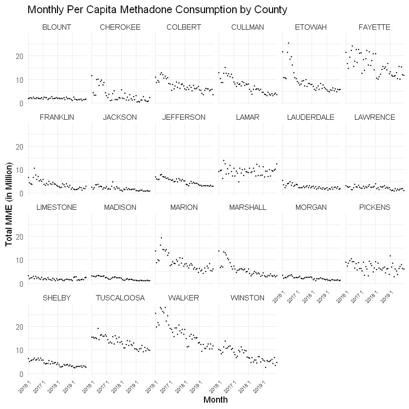
    


    
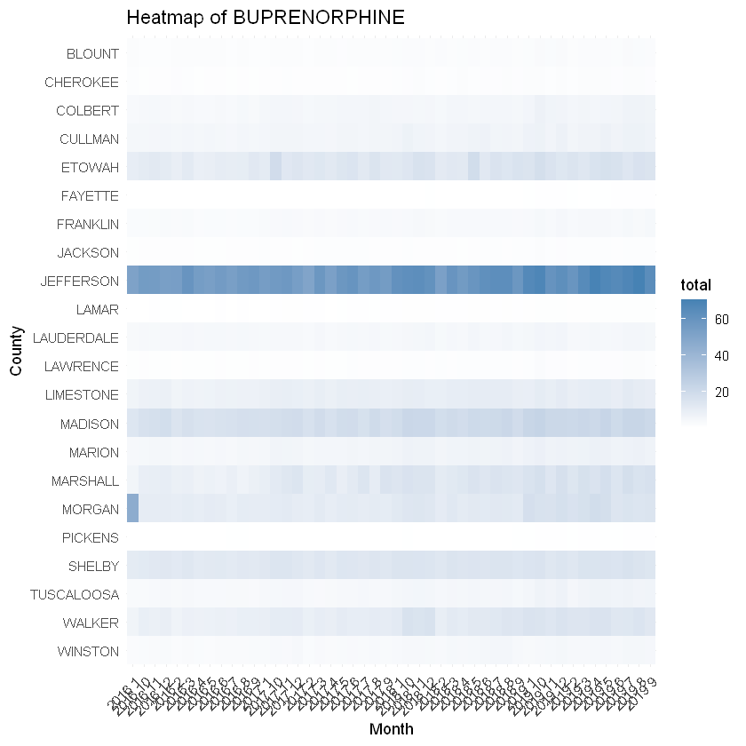
    


    
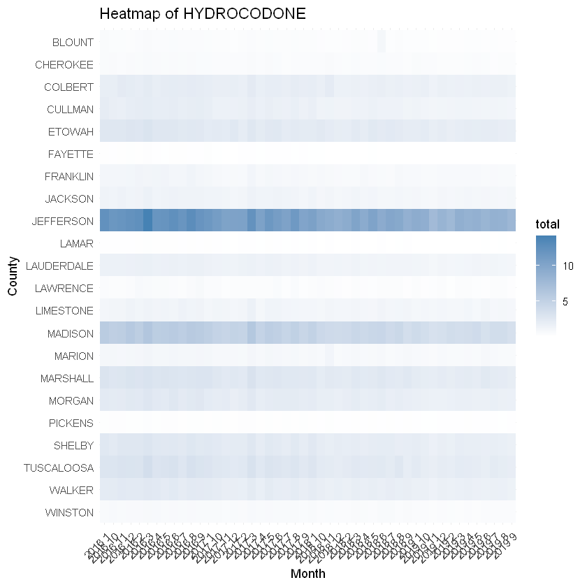
    


    
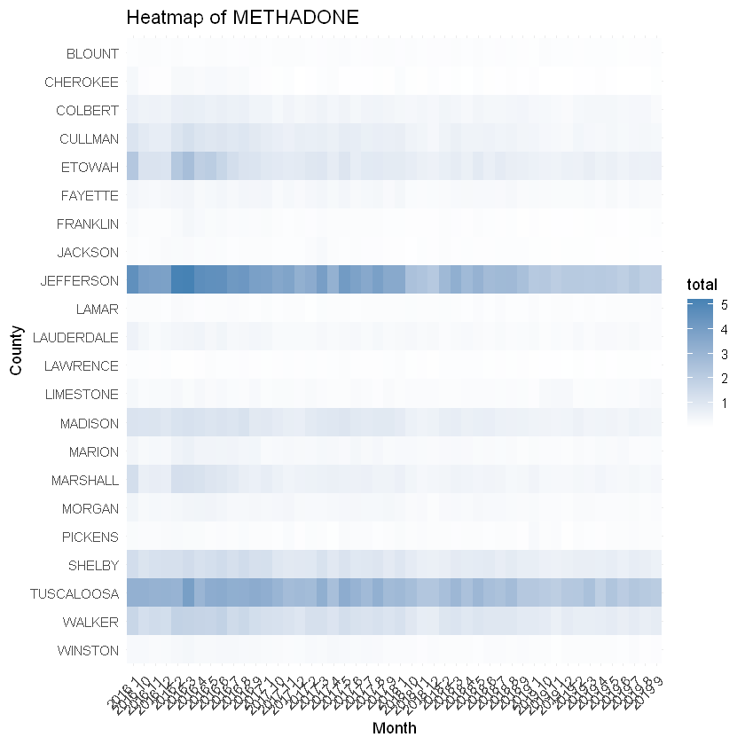
    


    Error: 'Data/ARCOS_AL_2016_2019_cleaned.csv' does not exist in current working directory ('C:/Users/julia/OneDrive - The University of Alabama/Research/2025-5-ER-Spatial-Autocorrelation/notebook').
    Traceback:
    

    1. vroom::vroom(file, delim = ",", col_names = col_names, col_types = col_types, 
     .     col_select = {
     .         {
     .             col_select
     .         }
     .     }, id = id, .name_repair = name_repair, skip = skip, n_max = n_max, 
     .     na = na, quote = quote, comment = comment, skip_empty_rows = skip_empty_rows, 
     .     trim_ws = trim_ws, escape_double = TRUE, escape_backslash = FALSE, 
     .     locale = locale, guess_max = guess_max, show_col_types = show_col_types, 
     .     progress = progress, altrep = lazy, num_threads = num_threads)

    2. vroom_(file, delim = delim %||% col_types$delim, col_names = col_names, 
     .     col_types = col_types, id = id, skip = skip, col_select = col_select, 
     .     name_repair = .name_repair, na = na, quote = quote, trim_ws = trim_ws, 
     .     escape_double = escape_double, escape_backslash = escape_backslash, 
     .     comment = comment, skip_empty_rows = skip_empty_rows, locale = locale, 
     .     guess_max = guess_max, n_max = n_max, altrep = vroom_altrep(altrep), 
     .     num_threads = num_threads, progress = progress)

    3. (function (path, write = FALSE) 
     . {
     .     if (is.raw(path)) {
     .         return(rawConnection(path, "rb"))
     .     }
     .     if (!is.character(path)) {
     .         return(path)
     .     }
     .     if (is_url(path)) {
     .         if (requireNamespace("curl", quietly = TRUE)) {
     .             con <- curl::curl(path)
     .         }
     .         else {
     .             inform("`curl` package not installed, falling back to using `url()`")
     .             con <- url(path)
     .         }
     .         ext <- tolower(tools::file_ext(path))
     .         return(switch(ext, zip = , bz2 = , xz = {
     .             close(con)
     .             stop("Reading from remote `", ext, "` compressed files is not supported,\n", 
     .                 "  download the files locally first.", call. = FALSE)
     .         }, gz = gzcon(con), con))
     .     }
     .     path <- enc2utf8(path)
     .     p <- split_path_ext(basename_utf8(path))
     .     if (write) {
     .         path <- normalizePath_utf8(path, mustWork = FALSE)
     .     }
     .     else {
     .         path <- check_path(path)
     .     }
     .     if (is_installed("archive")) {
     .         formats <- archive_formats(p$extension)
     .         extension <- p$extension
     .         while (is.null(formats) && nzchar(extension)) {
     .             extension <- split_path_ext(extension)$extension
     .             formats <- archive_formats(extension)
     .         }
     .         if (!is.null(formats)) {
     .             p$extension <- extension
     .             if (write) {
     .                 if (is.null(formats[[1]])) {
     .                   return(archive::file_write(path, filter = formats[[2]]))
     .                 }
     .                 return(archive::archive_write(path, p$path, format = formats[[1]], 
     .                   filter = formats[[2]]))
     .             }
     .             if (is.null(formats[[1]])) {
     .                 return(archive::file_read(path, filter = formats[[2]]))
     .             }
     .             return(archive::archive_read(path, format = formats[[1]], 
     .                 filter = formats[[2]]))
     .         }
     .     }
     .     if (!write) {
     .         compression <- detect_compression(path)
     .     }
     .     else {
     .         compression <- NA
     .     }
     .     if (is.na(compression)) {
     .         compression <- tools::file_ext(path)
     .     }
     .     if (write && compression == "zip") {
     .         stop("Can only read from, not write to, .zip", call. = FALSE)
     .     }
     .     switch(compression, gz = gzfile(path, ""), bz2 = bzfile(path, 
     .         ""), xz = xzfile(path, ""), zip = zipfile(path, ""), 
     .         if (!has_trailing_newline(path)) {
     .             file(path)
     .         } else {
     .             path
     .         })
     . })("Data/ARCOS_AL_2016_2019_cleaned.csv")

    4. check_path(path)

    5. stop("'", path, "' does not exist", if (!is_absolute_path(path)) {
     .     paste0(" in current working directory ('", getwd(), "')")
     . }, ".", call. = FALSE)

    6. .handleSimpleError(function (cnd) 
     . {
     .     watcher$capture_plot_and_output()
     .     cnd <- sanitize_call(cnd)
     .     watcher$push(cnd)
     .     switch(on_error, continue = invokeRestart("eval_continue"), 
     .         stop = invokeRestart("eval_stop"), error = NULL)
     . }, "'Data/ARCOS_AL_2016_2019_cleaned.csv' does not exist in current working directory ('C:/Users/julia/OneDrive - The University of Alabama/Research/2025-5-ER-Spatial-Autocorrelation/notebook').", 
     .     base::quote(NULL))


    
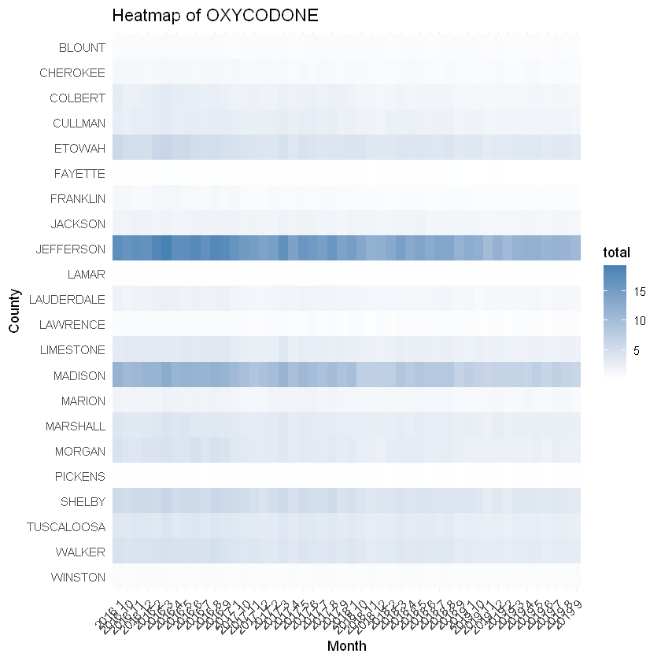
    


### 3. Spatiotemporal Analysis


```R
# Get Geographic information
#invisible(install.packages("tigris"))
invisible(library(tigris))

# Prepare for repr system to render spatial (sf) objects in rich formats (like maps) inside Jupyter Notebooks
#invisible(install.packages("geojsonio"))
invisible(library(geojsonio))


# Prepare sdmTMB package and sf files reading
#invisible(install.packages("sdmTMB"))
invisible(library(sdmTMB))
invisible(library(sf))
```


```R
head(al_counties_filted)
```


    Error: object 'al_counties_filted' not found
    Traceback:
    

    1. .handleSimpleError(function (cnd) 
     . {
     .     watcher$capture_plot_and_output()
     .     cnd <- sanitize_call(cnd)
     .     watcher$push(cnd)
     .     switch(on_error, continue = invokeRestart("eval_continue"), 
     .         stop = invokeRestart("eval_stop"), error = NULL)
     . }, "object 'al_counties_filted' not found", base::quote(eval(expr, 
     .     envir)))


```R
# Read AL counties's geographic information from tigris package
al_counties <- counties(state = "AL", cb = TRUE, class = "sf")


# Mutate County variable
al_counties$County <- toupper(al_counties$NAME) 

# Filter Counties located at northwest of AL
al_counties_filted <- al_counties%>%
  filter(County %in% toupper(c(
    "Lauderdale", "Limestone", "Madison", "Jackson", "Colbert", "Franklin",
    "Lawrence", "Morgan", "Marshall", "Dekalb", "Marion", "Winston",
    "Cullman", "Blount", "Etowah", "Cherokee", "Lamar", "Fayette",
    "Walker", "Jefferson", "St. Clair", "Pickens", "Tuscaloosa", "Shelby"
  ))
  )

```

    Retrieving data for the year 2024
    
    


    Error in data.matrix(data): 'list' object cannot be coerced to type 'double'
    Traceback:
    

    1. filter(., County %in% toupper(c("Lauderdale", "Limestone", "Madison", 
     .     "Jackson", "Colbert", "Franklin", "Lawrence", "Morgan", "Marshall", 
     .     "Dekalb", "Marion", "Winston", "Cullman", "Blount", "Etowah", 
     .     "Cherokee", "Lamar", "Fayette", "Walker", "Jefferson", "St. Clair", 
     .     "Pickens", "Tuscaloosa", "Shelby")))

    2. as.ts(x)

    3. as.ts.default(x)

    4. ts(x)

    5. data.matrix(data)

    6. .handleSimpleError(function (cnd) 
     . {
     .     watcher$capture_plot_and_output()
     .     cnd <- sanitize_call(cnd)
     .     watcher$push(cnd)
     .     switch(on_error, continue = invokeRestart("eval_continue"), 
     .         stop = invokeRestart("eval_stop"), error = NULL)
     . }, "'list' object cannot be coerced to type 'double'", base::quote(data.matrix(data)))


```R
# Join ER data and GIS on County
ER_GIS <- left_join(Data_ER_filted,al_counties_filted, by = c("County"))

#write.csv(ER_GIS, "../Data/ER_GIS.csv")

# Convert dataset to sf structure
ER_GIS_sf <- st_as_sf(ER_GIS)
```


```R
# Plot Spatiotemporal for ER Visits
p <- ggplot(data = ER_GIS) +
  geom_sf(aes(fill = Count)) +
  facet_wrap(~ year) +
  scale_fill_viridis_c(option = "plasma") + #"cividis" "viridis"
  labs(
    title = "Opioid-Related ER Visits by County",
    subtitle = "Northwest Alabama"
  ) +
  geom_sf_text(aes(label = County), size = 2, color = "white", fontface = "bold") +
  theme_minimal()


# Display in notebook
print(p)

# Save the figure
ggsave("../output/3_ER_spatiotemporal.png", plot = p, width = 9, height = 6, dpi = 300)
```

    Warning message in st_point_on_surface.sfc(sf::st_zm(x)):
    "st_point_on_surface may not give correct results for longitude/latitude data"
    Warning message in st_point_on_surface.sfc(sf::st_zm(x)):
    "st_point_on_surface may not give correct results for longitude/latitude data"
    Warning message in st_point_on_surface.sfc(sf::st_zm(x)):
    "st_point_on_surface may not give correct results for longitude/latitude data"
    Warning message in st_point_on_surface.sfc(sf::st_zm(x)):
    "st_point_on_surface may not give correct results for longitude/latitude data"
    Warning message in st_point_on_surface.sfc(sf::st_zm(x)):
    "st_point_on_surface may not give correct results for longitude/latitude data"
    Warning message in st_point_on_surface.sfc(sf::st_zm(x)):
    "st_point_on_surface may not give correct results for longitude/latitude data"
    Warning message in st_point_on_surface.sfc(sf::st_zm(x)):
    "st_point_on_surface may not give correct results for longitude/latitude data"
    Warning message in st_point_on_surface.sfc(sf::st_zm(x)):
    "st_point_on_surface may not give correct results for longitude/latitude data"
    


    
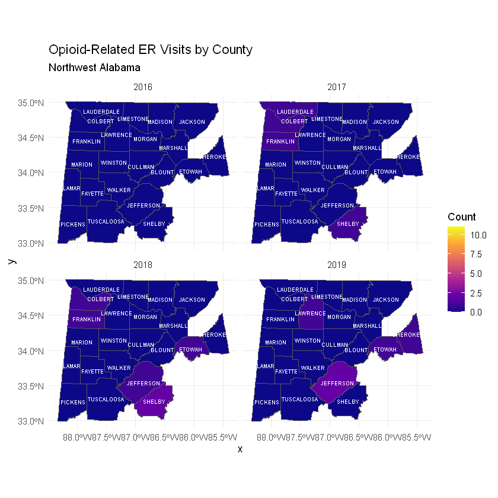
    


```R
# Plot Spatiotemporal for ER Per Capita Visits
p <- ggplot(data = ER_GIS) +
  geom_sf(aes(fill = case_percapita)) +
  facet_wrap(~ year) +
  scale_fill_viridis_c(option = "plasma") + #"cividis" "viridis"
  labs(
    title = "Opioid-Related ER Visits Per Capita by County",
    subtitle = "Northwest Alabama"
  ) +
  geom_sf_text(aes(label = County), size = 2, color = "white", fontface = "bold") +
  theme_minimal()


# Display in notebook
print(p)

# Save the figure
ggsave("../output/3_ER_per_spatiotemporal.png", plot = p, width = 9, height = 6, dpi = 300)
```

    Warning message in st_point_on_surface.sfc(sf::st_zm(x)):
    "st_point_on_surface may not give correct results for longitude/latitude data"
    Warning message in st_point_on_surface.sfc(sf::st_zm(x)):
    "st_point_on_surface may not give correct results for longitude/latitude data"
    Warning message in st_point_on_surface.sfc(sf::st_zm(x)):
    "st_point_on_surface may not give correct results for longitude/latitude data"
    Warning message in st_point_on_surface.sfc(sf::st_zm(x)):
    "st_point_on_surface may not give correct results for longitude/latitude data"
    


    
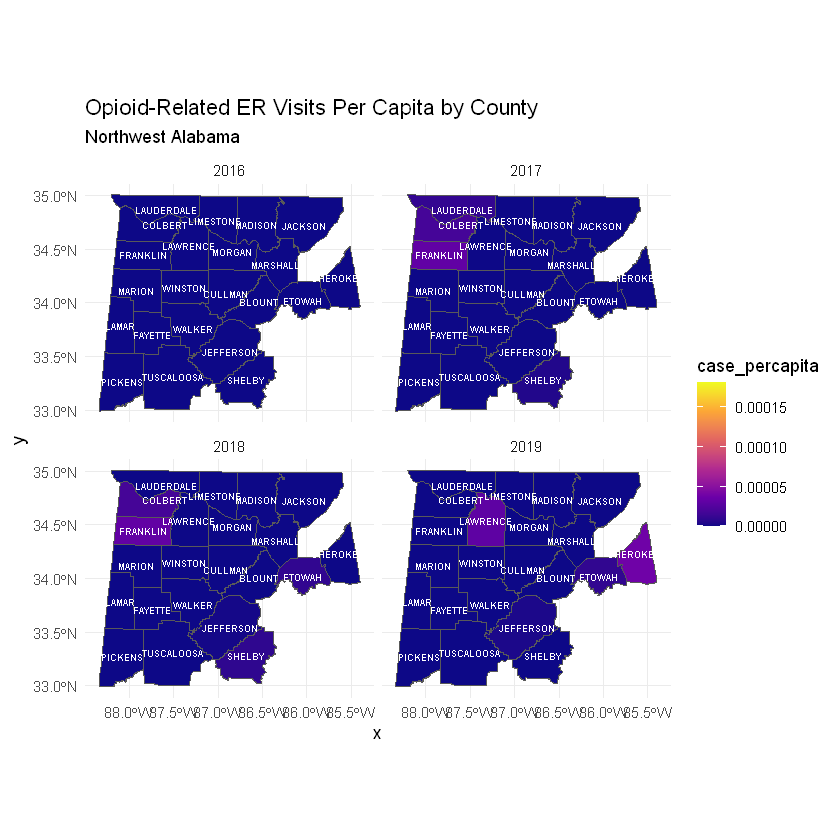
    


```R
Data_BUPRENORPHINE <- Data_ARCOS_filted %>%
    filter(drug == "BUPRENORPHINE")

BUPRENORPHINE_GIS <- left_join(Data_BUPRENORPHINE, al_counties_filted, by = c("County"))

write.csv(BUPRENORPHINE_GIS, "../Data/BUPRENORPHINE_GIS.csv")

# Convert dataset to sf structure
BUPRENORPHINE_GIS <- st_as_sf(BUPRENORPHINE_GIS)
```


```R
# Plot Spatiotemporal for Medication Visits
p <- ggplot(data = BUPRENORPHINE_GIS) +
  geom_sf(aes(fill = mme)) +
  facet_wrap(~ year) +
  scale_fill_viridis_c(option = "plasma") + #"cividis" "viridis"
  labs(
    title = "Buprenorphine Consumption by County",
    subtitle = "Northwest Alabama"
  ) +
  geom_sf_text(aes(label = County), size = 2, color = "white", fontface = "bold") +
  theme_minimal()


# Display in notebook
print(p)

# Save the figure
ggsave("../output/3_Buprenorphine_spatiotemporal.png", plot = p, width = 9, height = 6, dpi = 300)
```

    Warning message in st_point_on_surface.sfc(sf::st_zm(x)):
    "st_point_on_surface may not give correct results for longitude/latitude data"
    Warning message in st_point_on_surface.sfc(sf::st_zm(x)):
    "st_point_on_surface may not give correct results for longitude/latitude data"
    Warning message in st_point_on_surface.sfc(sf::st_zm(x)):
    "st_point_on_surface may not give correct results for longitude/latitude data"
    Warning message in st_point_on_surface.sfc(sf::st_zm(x)):
    "st_point_on_surface may not give correct results for longitude/latitude data"
    Warning message in st_point_on_surface.sfc(sf::st_zm(x)):
    "st_point_on_surface may not give correct results for longitude/latitude data"
    Warning message in st_point_on_surface.sfc(sf::st_zm(x)):
    "st_point_on_surface may not give correct results for longitude/latitude data"
    Warning message in st_point_on_surface.sfc(sf::st_zm(x)):
    "st_point_on_surface may not give correct results for longitude/latitude data"
    Warning message in st_point_on_surface.sfc(sf::st_zm(x)):
    "st_point_on_surface may not give correct results for longitude/latitude data"
    


    
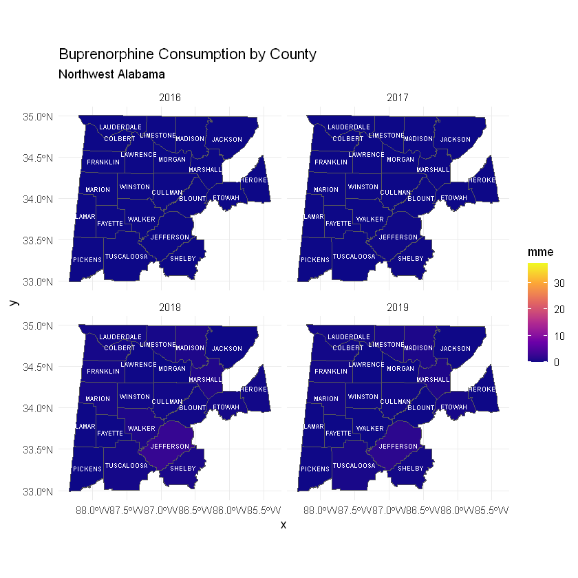
    


```R
# Plot Spatiotemporal for Medication Consumption (Rate)
p <- ggplot(data = BUPRENORPHINE_GIS) +
  geom_sf(aes(fill = mme_percapita)) +
  facet_wrap(~ year) +
  scale_fill_viridis_c(option = "plasma") + #"cividis" "viridis"
  labs(
    title = "Buprenorphine Consumption Rate (Per Capita) by County",
    subtitle = "Northwest Alabama"
  ) +
  geom_sf_text(aes(label = County), size = 2, color = "white", fontface = "bold") +
  theme_minimal()


# Display in notebook
print(p)

# Save the figure
ggsave("../output/3_Buprenorphine_rate_spatiotemporal.png", plot = p, width = 9, height = 6, dpi = 300)
```

    Warning message in st_point_on_surface.sfc(sf::st_zm(x)):
    "st_point_on_surface may not give correct results for longitude/latitude data"
    Warning message in st_point_on_surface.sfc(sf::st_zm(x)):
    "st_point_on_surface may not give correct results for longitude/latitude data"
    Warning message in st_point_on_surface.sfc(sf::st_zm(x)):
    "st_point_on_surface may not give correct results for longitude/latitude data"
    Warning message in st_point_on_surface.sfc(sf::st_zm(x)):
    "st_point_on_surface may not give correct results for longitude/latitude data"
    Warning message in st_point_on_surface.sfc(sf::st_zm(x)):
    "st_point_on_surface may not give correct results for longitude/latitude data"
    Warning message in st_point_on_surface.sfc(sf::st_zm(x)):
    "st_point_on_surface may not give correct results for longitude/latitude data"
    Warning message in st_point_on_surface.sfc(sf::st_zm(x)):
    "st_point_on_surface may not give correct results for longitude/latitude data"
    Warning message in st_point_on_surface.sfc(sf::st_zm(x)):
    "st_point_on_surface may not give correct results for longitude/latitude data"
    


    
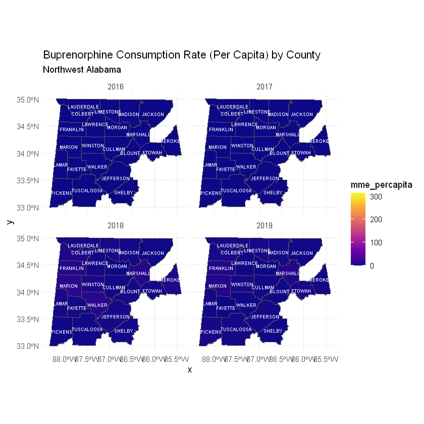
    


```R
Data_HYDROCODONE <- Data_ARCOS_filted %>%
    filter(drug == "HYDROCODONE")

HYDROCODONE_GIS <- left_join(Data_HYDROCODONE, al_counties_filted, by = c("County"))

write.csv(HYDROCODONE_GIS, "../Data/HYDROCODONE_GIS.csv")

# Convert dataset to sf structure
HYDROCODONE_GIS <- st_as_sf(HYDROCODONE_GIS)
```


```R
# Plot Spatiotemporal for Medication Visits
p <- ggplot(data = HYDROCODONE_GIS) +
  geom_sf(aes(fill = mme)) +
  facet_wrap(~ year) +
  scale_fill_viridis_c(option = "plasma") + #"cividis" "viridis"
  labs(
    title = "Hydrocodone Consumption by County",
    subtitle = "Northwest Alabama"
  ) +
  geom_sf_text(aes(label = County), size = 2, color = "white", fontface = "bold") +
  theme_minimal()


# Display in notebook
print(p)

# Save the figure
ggsave("../output/3_Hydrocodone_spatiotemporal.png", plot = p, width = 9, height = 6, dpi = 300)
```

    Warning message in st_point_on_surface.sfc(sf::st_zm(x)):
    "st_point_on_surface may not give correct results for longitude/latitude data"
    Warning message in st_point_on_surface.sfc(sf::st_zm(x)):
    "st_point_on_surface may not give correct results for longitude/latitude data"
    Warning message in st_point_on_surface.sfc(sf::st_zm(x)):
    "st_point_on_surface may not give correct results for longitude/latitude data"
    Warning message in st_point_on_surface.sfc(sf::st_zm(x)):
    "st_point_on_surface may not give correct results for longitude/latitude data"
    Warning message in st_point_on_surface.sfc(sf::st_zm(x)):
    "st_point_on_surface may not give correct results for longitude/latitude data"
    Warning message in st_point_on_surface.sfc(sf::st_zm(x)):
    "st_point_on_surface may not give correct results for longitude/latitude data"
    Warning message in st_point_on_surface.sfc(sf::st_zm(x)):
    "st_point_on_surface may not give correct results for longitude/latitude data"
    Warning message in st_point_on_surface.sfc(sf::st_zm(x)):
    "st_point_on_surface may not give correct results for longitude/latitude data"
    


    
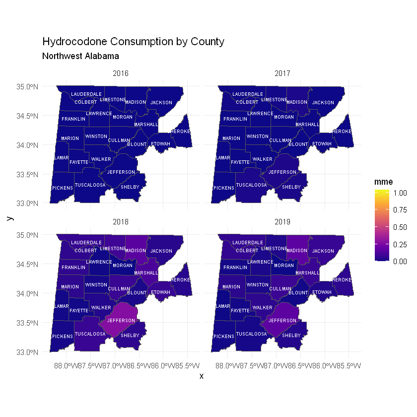
    


```R
# Plot Spatiotemporal for HYDROCODONE consumption
p <- ggplot(data = HYDROCODONE_GIS) +
  geom_sf(aes(fill = mme_percapita)) +
  facet_wrap(~ year) +
  scale_fill_viridis_c(option = "plasma") + #"cividis" "viridis"
  labs(
    title = "Hydrocodone Consumption Rate (Per Capita) by County",
    subtitle = "Northwest Alabama"
  ) +
  geom_sf_text(aes(label = County), size = 2, color = "white", fontface = "bold") +
  theme_minimal()


# Display in notebook
print(p)

# Save the figure
ggsave("../output/3_Hydrocodone_rate_spatiotemporal.png", plot = p, width = 9, height = 6, dpi = 300)
```

    Warning message in st_point_on_surface.sfc(sf::st_zm(x)):
    "st_point_on_surface may not give correct results for longitude/latitude data"
    Warning message in st_point_on_surface.sfc(sf::st_zm(x)):
    "st_point_on_surface may not give correct results for longitude/latitude data"
    Warning message in st_point_on_surface.sfc(sf::st_zm(x)):
    "st_point_on_surface may not give correct results for longitude/latitude data"
    Warning message in st_point_on_surface.sfc(sf::st_zm(x)):
    "st_point_on_surface may not give correct results for longitude/latitude data"
    Warning message in st_point_on_surface.sfc(sf::st_zm(x)):
    "st_point_on_surface may not give correct results for longitude/latitude data"
    Warning message in st_point_on_surface.sfc(sf::st_zm(x)):
    "st_point_on_surface may not give correct results for longitude/latitude data"
    Warning message in st_point_on_surface.sfc(sf::st_zm(x)):
    "st_point_on_surface may not give correct results for longitude/latitude data"
    Warning message in st_point_on_surface.sfc(sf::st_zm(x)):
    "st_point_on_surface may not give correct results for longitude/latitude data"
    


    

    


```R
Data_METHADONE <- Data_ARCOS_filted %>%
    filter(drug == "METHADONE")

METHADONE_GIS <- left_join(Data_METHADONE, al_counties_filted, by = c("County"))

write.csv(METHADONE_GIS, "../Data/METHADONE_GIS.csv")

# Convert dataset to sf structure
METHADONE_GIS <- st_as_sf(METHADONE_GIS)
```


```R
# Plot Spatiotemporal for Medication Visits
p <- ggplot(data = METHADONE_GIS) +
  geom_sf(aes(fill = mme)) +
  facet_wrap(~ year) +
  scale_fill_viridis_c(option = "plasma") + #"cividis" "viridis"
  labs(
    title = "Methadone Consumption by County",
    subtitle = "Northwest Alabama"
  ) +
  geom_sf_text(aes(label = County), size = 2, color = "white", fontface = "bold") +
  theme_minimal()


# Display in notebook
print(p)

# Save the figure
ggsave("../output/3_Methadone_spatiotemporal.png", plot = p, width = 9, height = 6, dpi = 300)
```

    Warning message in st_point_on_surface.sfc(sf::st_zm(x)):
    "st_point_on_surface may not give correct results for longitude/latitude data"
    Warning message in st_point_on_surface.sfc(sf::st_zm(x)):
    "st_point_on_surface may not give correct results for longitude/latitude data"
    Warning message in st_point_on_surface.sfc(sf::st_zm(x)):
    "st_point_on_surface may not give correct results for longitude/latitude data"
    Warning message in st_point_on_surface.sfc(sf::st_zm(x)):
    "st_point_on_surface may not give correct results for longitude/latitude data"
    Warning message in st_point_on_surface.sfc(sf::st_zm(x)):
    "st_point_on_surface may not give correct results for longitude/latitude data"
    Warning message in st_point_on_surface.sfc(sf::st_zm(x)):
    "st_point_on_surface may not give correct results for longitude/latitude data"
    Warning message in st_point_on_surface.sfc(sf::st_zm(x)):
    "st_point_on_surface may not give correct results for longitude/latitude data"
    Warning message in st_point_on_surface.sfc(sf::st_zm(x)):
    "st_point_on_surface may not give correct results for longitude/latitude data"
    


    
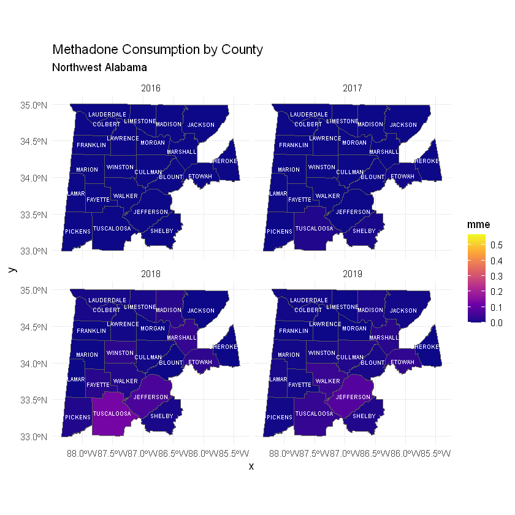
    


```R
# Plot Spatiotemporal for METHADONE consumption
p <- ggplot(data = METHADONE_GIS) +
  geom_sf(aes(fill = mme_percapita)) +
  facet_wrap(~ year) +
  scale_fill_viridis_c(option = "plasma") + #"cividis" "viridis"
  labs(
    title = "Methadone Consumption Rate (Per Capita) by County",
    subtitle = "Northwest Alabama"
  ) +
  geom_sf_text(aes(label = County), size = 2, color = "white", fontface = "bold") +
  theme_minimal()


# Display in notebook
print(p)

# Save the figure
ggsave("../output/3_Methadone_rate_spatiotemporal.png", plot = p, width = 9, height = 6, dpi = 300)
```

    Warning message in st_point_on_surface.sfc(sf::st_zm(x)):
    "st_point_on_surface may not give correct results for longitude/latitude data"
    Warning message in st_point_on_surface.sfc(sf::st_zm(x)):
    "st_point_on_surface may not give correct results for longitude/latitude data"
    Warning message in st_point_on_surface.sfc(sf::st_zm(x)):
    "st_point_on_surface may not give correct results for longitude/latitude data"
    Warning message in st_point_on_surface.sfc(sf::st_zm(x)):
    "st_point_on_surface may not give correct results for longitude/latitude data"
    Warning message in st_point_on_surface.sfc(sf::st_zm(x)):
    "st_point_on_surface may not give correct results for longitude/latitude data"
    Warning message in st_point_on_surface.sfc(sf::st_zm(x)):
    "st_point_on_surface may not give correct results for longitude/latitude data"
    Warning message in st_point_on_surface.sfc(sf::st_zm(x)):
    "st_point_on_surface may not give correct results for longitude/latitude data"
    Warning message in st_point_on_surface.sfc(sf::st_zm(x)):
    "st_point_on_surface may not give correct results for longitude/latitude data"
    


    
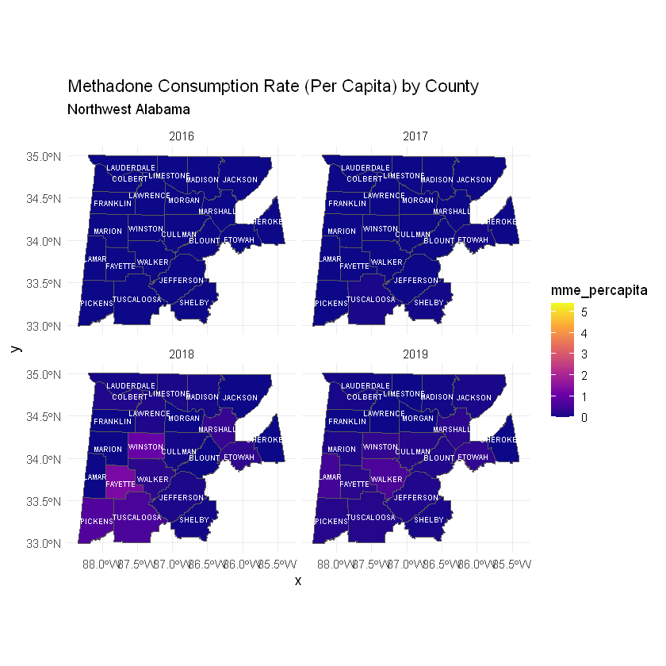
    


```R
Data_OXYCODONE <- Data_ARCOS_filted %>%
    filter(drug == "OXYCODONE")

OXYCODONE_GIS <- left_join(Data_OXYCODONE, al_counties_filted, by = c("County"))

write.csv(OXYCODONE_GIS, "../Data/OXYCODONE_GIS.csv")

# Convert dataset to sf structure
OXYCODONE_GIS <- st_as_sf(OXYCODONE_GIS)
```


```R
# Plot Spatiotemporal for Medication Visits
p <- ggplot(data = OXYCODONE_GIS) +
  geom_sf(aes(fill = mme)) +
  facet_wrap(~ year) +
  scale_fill_viridis_c(option = "plasma") + #"cividis" "viridis"
  labs(
    title = "Oxycodone Consumption by County",
    subtitle = "Northwest Alabama"
  ) +
  geom_sf_text(aes(label = County), size = 2, color = "white", fontface = "bold") +
  theme_minimal()


# Display in notebook
print(p)

# Save the figure
ggsave("../output/3_Oxycodone_spatiotemporal.png", plot = p, width = 9, height = 6, dpi = 300)
```

    Warning message in st_point_on_surface.sfc(sf::st_zm(x)):
    "st_point_on_surface may not give correct results for longitude/latitude data"
    Warning message in st_point_on_surface.sfc(sf::st_zm(x)):
    "st_point_on_surface may not give correct results for longitude/latitude data"
    Warning message in st_point_on_surface.sfc(sf::st_zm(x)):
    "st_point_on_surface may not give correct results for longitude/latitude data"
    Warning message in st_point_on_surface.sfc(sf::st_zm(x)):
    "st_point_on_surface may not give correct results for longitude/latitude data"
    Warning message in st_point_on_surface.sfc(sf::st_zm(x)):
    "st_point_on_surface may not give correct results for longitude/latitude data"
    Warning message in st_point_on_surface.sfc(sf::st_zm(x)):
    "st_point_on_surface may not give correct results for longitude/latitude data"
    Warning message in st_point_on_surface.sfc(sf::st_zm(x)):
    "st_point_on_surface may not give correct results for longitude/latitude data"
    Warning message in st_point_on_surface.sfc(sf::st_zm(x)):
    "st_point_on_surface may not give correct results for longitude/latitude data"
    


    
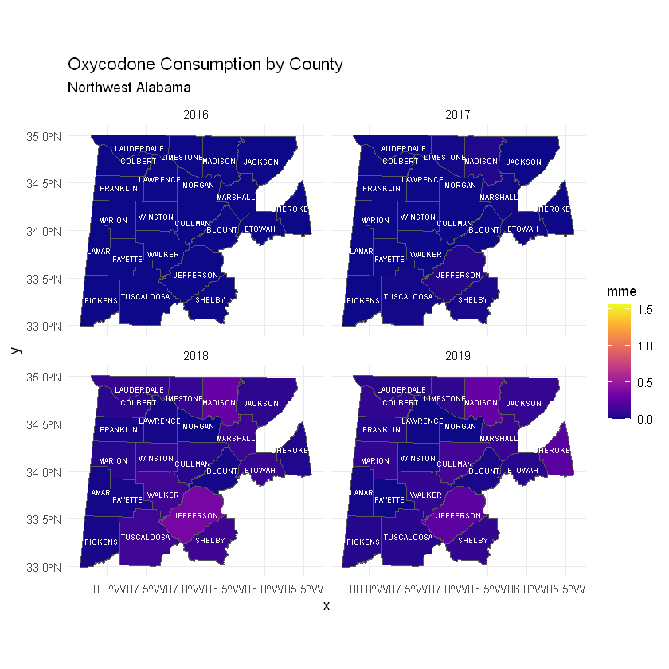
    


```R
# Plot Spatiotemporal for OXYCODONE consumption
p <- ggplot(data = OXYCODONE_GIS) +
  geom_sf(aes(fill = mme_percapita)) +
  facet_wrap(~ year) +
  scale_fill_viridis_c(option = "plasma") + #"cividis" "viridis"
  labs(
    title = "Oxycodone Consumption Rate (Per Capita) by County",
    subtitle = "Northwest Alabama"
  ) +
  geom_sf_text(aes(label = County), size = 2, color = "white", fontface = "bold") +
  theme_minimal()


# Display in notebook
print(p)

# Save the figure
ggsave("../output/3_Oxycodone_rate_spatiotemporal.png", plot = p, width = 9, height = 6, dpi = 300)
```

    Warning message in st_point_on_surface.sfc(sf::st_zm(x)):
    "st_point_on_surface may not give correct results for longitude/latitude data"
    Warning message in st_point_on_surface.sfc(sf::st_zm(x)):
    "st_point_on_surface may not give correct results for longitude/latitude data"
    Warning message in st_point_on_surface.sfc(sf::st_zm(x)):
    "st_point_on_surface may not give correct results for longitude/latitude data"
    Warning message in st_point_on_surface.sfc(sf::st_zm(x)):
    "st_point_on_surface may not give correct results for longitude/latitude data"
    Warning message in st_point_on_surface.sfc(sf::st_zm(x)):
    "st_point_on_surface may not give correct results for longitude/latitude data"
    Warning message in st_point_on_surface.sfc(sf::st_zm(x)):
    "st_point_on_surface may not give correct results for longitude/latitude data"
    Warning message in st_point_on_surface.sfc(sf::st_zm(x)):
    "st_point_on_surface may not give correct results for longitude/latitude data"
    Warning message in st_point_on_surface.sfc(sf::st_zm(x)):
    "st_point_on_surface may not give correct results for longitude/latitude data"
    


    
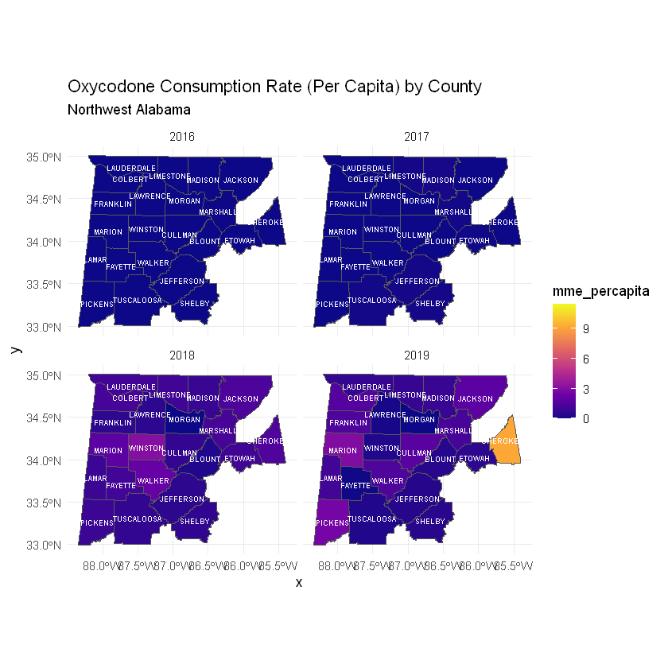
    


```R
head(ER_GIS)
```


<table class="dataframe">
<caption>A sf: 6 × 23</caption>
<thead>
	<tr><th scope=col>...1</th><th scope=col>Date</th><th scope=col>County</th><th scope=col>Count</th><th scope=col>pop</th><th scope=col>case_percapita</th><th scope=col>year</th><th scope=col>month</th><th scope=col>year_month</th><th scope=col>week</th><th scope=col>geometry</th><th scope=col>⋯</th><th scope=col>GEOIDFQ</th><th scope=col>GEOID</th><th scope=col>NAME</th><th scope=col>NAMELSAD</th><th scope=col>STUSPS</th><th scope=col>STATE_NAME</th><th scope=col>LSAD</th><th scope=col>ALAND</th><th scope=col>AWATER</th><th scope=col>geometry</th></tr>
	<tr><th scope=col>&lt;dbl&gt;</th><th scope=col>&lt;date&gt;</th><th scope=col>&lt;chr&gt;</th><th scope=col>&lt;dbl&gt;</th><th scope=col>&lt;dbl&gt;</th><th scope=col>&lt;dbl&gt;</th><th scope=col>&lt;dbl&gt;</th><th scope=col>&lt;dbl&gt;</th><th scope=col>&lt;chr&gt;</th><th scope=col>&lt;dbl&gt;</th><th scope=col>⋯</th><th scope=col>&lt;chr&gt;</th><th scope=col>&lt;chr&gt;</th><th scope=col>&lt;chr&gt;</th><th scope=col>&lt;chr&gt;</th><th scope=col>&lt;chr&gt;</th><th scope=col>&lt;chr&gt;</th><th scope=col>&lt;chr&gt;</th><th scope=col>&lt;dbl&gt;</th><th scope=col>&lt;dbl&gt;</th><th scope=col>&lt;MULTIPOLYGON [°]&gt;</th></tr>
</thead>
<tbody>
	<tr><td> 9</td><td>2016-01-01</td><td>BLOUNT  </td><td>0</td><td> 57494</td><td>0</td><td>2016</td><td>1</td><td>2016 1</td><td>0</td><td>MULTIPOLYGON (((-86.96336 3...</td><td>⋯</td><td>0500000US01009</td><td>01009</td><td>Blount  </td><td>Blount County  </td><td>AL</td><td>Alabama</td><td>06</td><td>1670259099</td><td> 14860281</td><td>MULTIPOLYGON (((-86.96336 3...</td></tr>
	<tr><td>19</td><td>2016-01-01</td><td>CHEROKEE</td><td>0</td><td> 25768</td><td>0</td><td>2016</td><td>1</td><td>2016 1</td><td>0</td><td>MULTIPOLYGON (((-85.84384 3...</td><td>⋯</td><td>0500000US01019</td><td>01019</td><td>Cherokee</td><td>Cherokee County</td><td>AL</td><td>Alabama</td><td>06</td><td>1433614765</td><td>120316891</td><td>MULTIPOLYGON (((-85.84384 3...</td></tr>
	<tr><td>33</td><td>2016-01-01</td><td>COLBERT </td><td>0</td><td> 54497</td><td>0</td><td>2016</td><td>1</td><td>2016 1</td><td>0</td><td>MULTIPOLYGON (((-88.13925 3...</td><td>⋯</td><td>0500000US01033</td><td>01033</td><td>Colbert </td><td>Colbert County </td><td>AL</td><td>Alabama</td><td>06</td><td>1535740663</td><td> 79162005</td><td>MULTIPOLYGON (((-88.13925 3...</td></tr>
	<tr><td>43</td><td>2016-01-01</td><td>CULLMAN </td><td>0</td><td> 82450</td><td>0</td><td>2016</td><td>1</td><td>2016 1</td><td>0</td><td>MULTIPOLYGON (((-87.15104 3...</td><td>⋯</td><td>0500000US01043</td><td>01043</td><td>Cullman </td><td>Cullman County </td><td>AL</td><td>Alabama</td><td>06</td><td>1902985237</td><td> 52510688</td><td>MULTIPOLYGON (((-87.15104 3...</td></tr>
	<tr><td>55</td><td>2016-01-01</td><td>ETOWAH  </td><td>0</td><td>102855</td><td>0</td><td>2016</td><td>1</td><td>2016 1</td><td>0</td><td>MULTIPOLYGON (((-86.36962 3...</td><td>⋯</td><td>0500000US01055</td><td>01055</td><td>Etowah  </td><td>Etowah County  </td><td>AL</td><td>Alabama</td><td>06</td><td>1386015447</td><td> 34924289</td><td>MULTIPOLYGON (((-86.36962 3...</td></tr>
	<tr><td>57</td><td>2016-01-01</td><td>FAYETTE </td><td>0</td><td> 16563</td><td>0</td><td>2016</td><td>1</td><td>2016 1</td><td>0</td><td>MULTIPOLYGON (((-87.95179 3...</td><td>⋯</td><td>0500000US01057</td><td>01057</td><td>Fayette </td><td>Fayette County </td><td>AL</td><td>Alabama</td><td>06</td><td>1625693253</td><td>  4330881</td><td>MULTIPOLYGON (((-87.95179 3...</td></tr>
</tbody>
</table>


```R
head(ER_GIS_sf)
```


    Error: object 'ER_GIS_sf' not found
    Traceback:
    

    1. .handleSimpleError(function (cnd) 
     . {
     .     watcher$capture_plot_and_output()
     .     cnd <- sanitize_call(cnd)
     .     watcher$push(cnd)
     .     switch(on_error, continue = invokeRestart("eval_continue"), 
     .         stop = invokeRestart("eval_stop"), error = NULL)
     . }, "object 'ER_GIS_sf' not found", base::quote(eval(expr, envir)))


```R
#ER_GIS

st_geometry(ER_GIS_sf) <- "geometry"      # set the correct geometry column
ER_GIS_sf <- ER_GIS_sf[, !duplicated(names(ER_GIS_sf))]  # drop duplicates if needed


```


    Error: object 'ER_GIS_sf' not found
    Traceback:
    


```R

er_year <- ER_GIS_sf %>%
  # Group data by County and year
  group_by(County, year) %>%
  # Summarize data for each county-year combination
  summarise(
    Count = sum(Count, na.rm = TRUE),     # Sum the Count variable, ignoring NA values
    pop   = mean(pop, na.rm = TRUE),      # Calculate mean population, ignoring NA values
    geometry = st_union(geometry),        # Merge geometries to keep one polygon per county
    .groups = "drop"                      # Drop grouping structure after summarizing
  )


# Safe interior point per county in projected CRS
centers <- st_point_on_surface(er_year)
coords  <- st_coordinates(centers)
er_year$X <- coords[,1]
er_year$Y <- coords[,2]

# Build the mesh
mesh <- make_mesh(er_year, xy_cols = c("X","Y"), cutoff = 30000)  # try 30 km; adjust if too coarse/fine


```


```R
fit <- sdmTMB(
  formula = Count ~ year + (1|County),
  data = ER_GIS,
  time = "year",        # Time variable
  mesh = mesh,          # Spatial mesh
  family = poisson(),
  spatial = "on",       # Include spatial random effect
  spatiotemporal = "ar1" # Temporal correlation across years
)
```


```R
data <- st_set_geometry(droplevels(st_drop_geometry(data)), st_geometry(data))
```


    Error in UseMethod("st_geometry"): no applicable method for 'st_geometry' applied to an object of class "function"
    Traceback:
    

    1. st_geometry(data)

    2. .handleSimpleError(function (cnd) 
     . {
     .     watcher$capture_plot_and_output()
     .     cnd <- sanitize_call(cnd)
     .     watcher$push(cnd)
     .     switch(on_error, continue = invokeRestart("eval_continue"), 
     .         stop = invokeRestart("eval_stop"), error = NULL)
     . }, "no applicable method for 'st_geometry' applied to an object of class \"function\"", 
     .     base::quote(UseMethod("st_geometry")))

